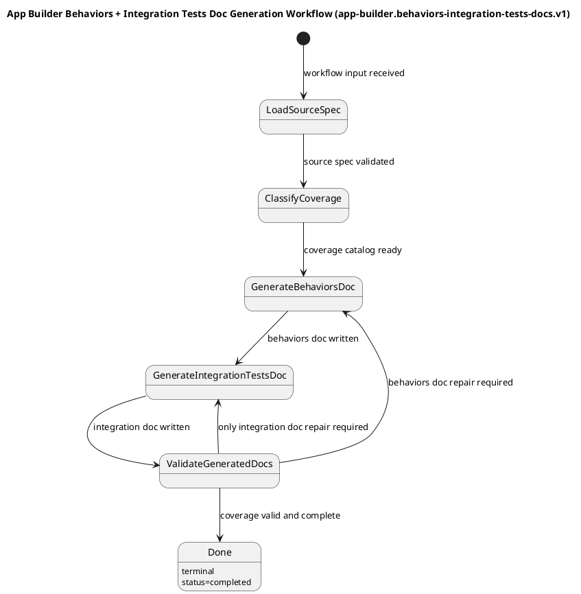

# App Builder Workflow Spec: Behaviors + Integration Tests Doc Generation FSM (v1)

## 1) Purpose

### Objective

Define a finite state machine workflow that reads an implementation-ready specification markdown document and generates two companion markdown documents in the workspace:

1. a behaviors document containing every directly end-to-end-testable behavior described by the source spec, each with explicit success criteria; and
2. an integration test document containing behaviors, invariants, and failure modes that are not directly verifiable via end-to-end black-box testing and therefore require integration-level coverage.

This workflow exists to keep workflow specifications, E2E behavior catalogs, and integration test plans aligned without requiring manual document authoring for each source spec.

## 2) Scope

In scope:
- one workflow: `app-builder.behaviors-integration-tests-docs.v1`
- reading one source spec markdown file from the workspace
- deriving deterministic target paths for the behaviors and integration test markdown documents when explicit paths are not supplied
- extracting normative source clauses from the source spec, including state semantics, transition guards, contract rules, observability requirements, completion criteria, acceptance criteria, and failure conditions
- classifying every extracted behavior, invariant, or failure mode as either directly E2E-testable or integration-primary
- writing or updating a behaviors markdown document
- writing or updating an integration test markdown document
- preserving stable behavior/test IDs from existing generated docs when the underlying source behavior has not changed
- validating that the two generated docs collectively cover the extracted source-spec obligations before terminal completion

### Non-Goals
- generating executable test code
- editing the source spec document itself
- starting servers or running test commands as part of workflow execution
- introducing human-feedback pauses or interactive approval in v1
- supporting free-form document layouts outside the repository's established behaviors/integration-doc conventions

### Constraints and Assumptions
- The source spec is the single source of truth. Generated docs must not invent obligations that are not grounded in the source spec.
- The workflow is non-interactive in v1. If the source spec is too incomplete or ambiguous to classify deterministically, the run must fail explicitly instead of asking a human follow-up question.
- After normalization and default-path derivation, `resolvedPaths.behaviorsDocPath` and `resolvedPaths.integrationTestsDocPath` must each differ from `resolvedPaths.specPath` and from each other. If any collision is detected, `LoadSourceSpec` must fail before generation begins.
- Generated docs must preserve prior accepted decisions from existing behaviors/integration docs when the same source behavior is still present; obsolete items that are no longer backed by the source spec must be removed on rewrite.
- Generated behaviors and integration-test docs are canonical workflow-owned outputs. Regeneration rewrites the required document structure deterministically, preserves prior IDs only through persisted stable-key markers and the defined `testCommands` rendering contract when supplied, and does not preserve arbitrary manual prose outside those managed surfaces unless it is re-emitted by the current generation contract.
- Every normative source clause extracted for coverage must map to at least one generated catalog item, and each generated catalog item must have exactly one primary ownership classification: `e2e` or `integration-primary`.
- `integration-primary` is allowed only when the behavior cannot be adequately verified from black-box E2E execution alone and requires deterministic doubles, direct state inspection, schema failure injection, controlled fault injection, or equivalent harness-only access.
- `CoverageCandidate` items marked `e2e` must appear in the behaviors doc. `CoverageCandidate` items marked `integration-primary` must appear in the integration test doc. Cross-references are allowed, but ownership must remain singular.
- Output ordering, stable keys, and generated IDs must be deterministic for identical source inputs.
- One workflow run assumes exclusive access to `specPath`, `behaviorsDocPath`, and `integrationTestsDocPath` for the full run. If any of those files is modified externally after the run starts, or another run targets the same outputs before the current run reaches `Done`, the workflow must fail explicitly rather than merging changes, continuing silently, or applying last-write-wins behavior.
- The workflow must follow the documentation conventions demonstrated by `spec-doc-generation-workflow.md`, `spec-doc-behaviors.md`, and `spec-doc-integration-tests.md`.

## 3) Planned Workflow Series (initial)

Only this workflow is specified now.

1. `app-builder.behaviors-integration-tests-docs.v1` (this doc)
2. Future: test-code scaffold generation workflow
3. Future: coverage drift detection workflow

## 4) Workflow Identity

- `workflowType`: `app-builder.behaviors-integration-tests-docs.v1`
- `workflowVersion`: `1.0.0`
- package: `workflow-app-builder`
- primary dependency workflow: `app-builder.copilot.prompt.v1`
- execution model: non-interactive parent FSM with deterministic validation/repair loop

## 5) Interfaces and Contracts

## 5.1 Input Contract

```ts
export interface BehaviorsIntegrationTestsDocGenerationInput {
  specPath: string;
  behaviorsDocPath?: string;
  integrationTestsDocPath?: string;
  docIdPrefix?: string;
  testCommands?: {
    e2eBlackbox?: string[];
    integration?: string[];
  };
  copilotPromptOptions?: {
    baseArgs?: string[];
    logDir?: string;
    allowedDirs?: string[];
    timeoutMs?: number; // default: 1_200_000 (20 minutes)
    cwd?: string;
  };
}
```

Input rules:
- `specPath` is required, must end in `.md`, and must point to an existing workspace file.
- `behaviorsDocPath` and `integrationTestsDocPath` are optional; when omitted, the workflow derives them deterministically from `specPath`.
- When `behaviorsDocPath` or `integrationTestsDocPath` is provided explicitly, the path must end in `.md`, resolve to a normalized path within the workspace, and be rejected if normalization would escape the workspace boundary.
- Path derivation rule:
  1. start with the source-spec filename without `.md`
  2. if the basename ends with `-generation-workflow`, remove that suffix
  3. else if the basename ends with `-workflow`, remove that suffix
  4. append `-behaviors.md` for the behaviors doc
  5. append `-integration-tests.md` for the integration test doc
- Path derivation examples:
  - `spec-doc-generation-workflow.md` -> `spec-doc-behaviors.md` and `spec-doc-integration-tests.md`
  - `foo-generation-workflow.md` -> `foo-behaviors.md` and `foo-integration-tests.md`
  - `my-workflow.md` -> `my-behaviors.md` and `my-integration-tests.md`
- After applying explicit-path normalization and/or default derivation, `behaviorsDocPath` must not equal `specPath`, `integrationTestsDocPath` must not equal `specPath`, and `behaviorsDocPath` must not equal `integrationTestsDocPath`. Any collision after normalization is a `LoadSourceSpec` failure and must prevent all generator-state execution.
- `docIdPrefix`, when omitted, is derived from the normalized basename after suffix stripping by taking the uppercase initials of the remaining hyphen-separated tokens. Example: `spec-doc-generation-workflow.md` -> `SD`.
- If either derived target file already exists, that file is treated as the existing doc to update in place.
- `testCommands` is optional metadata used only for document rendering. The workflow must not execute those commands.
- When `testCommands.e2eBlackbox` or `testCommands.integration` is present, each array element must be a non-empty command string. The workflow must preserve input array order exactly and render each command verbatim as one inline-code markdown bullet in the integration test document; it must not sort, deduplicate, or rewrite the commands.

## 5.2 LoadSourceSpec Output Contract

`LoadSourceSpec` produces the canonical local-extraction payload consumed by every downstream state.

```ts
export type RequiredSourceSection =
  | "objective-or-scope"
  | "non-goals"
  | "constraints-and-assumptions"
  | "interfaces-and-contracts"
  | "acceptance-criteria";

export interface RequiredSectionValidation {
  status: "valid" | "invalid";
  presentSections: RequiredSourceSection[];
  missingSections: RequiredSourceSection[];
}

export interface LoadSourceSpecOutput {
  resolvedPaths: {
    specPath: string;
    behaviorsDocPath: string;
    integrationTestsDocPath: string;
  };
  behaviorIdPrefix: string;
  specMarkdown: string;
  existingBehaviorsDocMarkdown: string | null;
  existingIntegrationDocMarkdown: string | null;
  sourceClauses: SourceClause[];
  requiredSectionValidation: RequiredSectionValidation;
}
```

Contract rules:
- `resolvedPaths` must contain the final normalized paths that all later states use without re-derivation.
- `behaviorIdPrefix` is the canonical derived-or-explicit prefix for the whole run; downstream states must reuse this value exactly.
- `specMarkdown` is the full source markdown string loaded from `resolvedPaths.specPath`.
- `existingBehaviorsDocMarkdown` and `existingIntegrationDocMarkdown` must be `null` when the target file does not exist and must otherwise contain the full current markdown body used for marker-based ID reuse and stale-item removal.
- If `resolvedPaths.behaviorsDocPath` or `resolvedPaths.integrationTestsDocPath` already exists but cannot be read as markdown text because of permission, encoding, or other I/O failure, `LoadSourceSpec` must fail explicitly rather than treating that file as absent.
- `sourceClauses` is the canonical locally extracted, source-ordered inventory from section 6.5. Downstream completeness checks must compare prompt output against this array rather than trusting prompt-produced clause extraction alone.
- `presentSections` and `missingSections` must contain no duplicates and must preserve the required-section order declared by `RequiredSourceSection`.
- Substantive normative content means content that survives the following normalization: trim whitespace, remove heading syntax, discard blank lines, and discard placeholder-only or cross-reference-only lines such as `TBD`, `TODO`, `N/A`, `none`, `future work`, or `see section X` when those lines do not themselves impose an obligation.
- A required source section counts as present only when at least one remaining sentence, bullet, numbered item, rule line, or contract/code-block item expresses a workflow behavior, boundary, constraint, contract rule, state expectation, acceptance condition, observability requirement, or failure condition that downstream classification must cover.
- A heading alone, placeholder text, or an otherwise empty section must be treated as missing for `LoadSourceSpec` validation even when the heading text itself matches a required section name.
- `requiredSectionValidation.status === "valid"` if and only if `missingSections.length === 0`.
- The workflow must not transition out of `LoadSourceSpec` unless `requiredSectionValidation.status === "valid"`.

## 5.3 Workflow Output Contract

The terminal `Done` payload must conform to `behaviors-integration-tests-doc-generation-output.schema.json` and mirror this shape exactly:

```ts
export interface BehaviorsIntegrationTestsDocGenerationOutput {
  status: "completed";
  resolvedPaths: {
    specPath: string;
    behaviorsDocPath: string;
    integrationTestsDocPath: string;
  };
  summary: {
    behaviorCount: number;
    integrationTestCount: number;
    integrationPrimaryCount: number;
    validationPasses: number;
    unownedSourceClauses: 0;
  };
  artifacts: {
    preservedBehaviorIds: number;
    preservedIntegrationTestIds: number;
  };
}
```

## 5.4 Coverage Catalog Contracts

`ClassifyCoverage` produces the normalized catalog consumed by both document-generation states and by the validator.

```ts
export type SourceClauseType =
  | "scope"
  | "constraint"
  | "contract"
  | "state"
  | "transition"
  | "acceptance-criterion"
  | "completion"
  | "observability"
  | "failure";

export interface SourceClause {
  clauseId: string;
  section: string;
  clauseType: SourceClauseType;
  summary: string;
}

export type BehaviorOwnership = "e2e" | "integration-primary";

export type IntegrationOnlyReason =
  | "deterministic-double"
  | "internal-state-inspection"
  | "schema-failure-injection"
  | "fault-injection"
  | "recovery-boundary"
  | "event-stream-internals";

export type BehaviorCategory =
  | "TRANS"
  | "DATA"
  | "CONTRACT"
  | "DEPENDENCY"
  | "OBS"
  | "DONE"
  | "FAIL";

export interface CoverageCandidate {
  stableKey: string;
  title: string;
  category: BehaviorCategory;
  ownership: BehaviorOwnership;
  sourceClauseIds: string[];
  given: string[];
  when: string;
  then: string[];
  successCriteria: string[];
  relatedBehaviorStableKeys?: string[];
  whyNotE2EOnly?: string;
  integrationOnlyReason?: IntegrationOnlyReason;
  harnessRequirements?: string[];
}

export interface GoldenScenarioCandidate {
  stableKey: string;
  title: string;
  steps: string[];
  expectedOutcomes: string[];
  relatedStableKeys: string[];
}

export interface CoverageCatalogOutput {
  sourceTitle: string;
  sourceWorkflowType?: string;
  behaviorIdPrefix: string;
  sourceClauses: SourceClause[];
  coverageCandidates: CoverageCandidate[];
  goldenScenarios: GoldenScenarioCandidate[];
}
```

Contract rules:
- `clauseId` values must be unique within one run and ordered by first appearance in the source spec.
- `sourceTitle` must be a non-empty human-readable title for the source spec and is the canonical title forwarded into both document-generation states for the current run.
- `behaviorIdPrefix` must equal `LoadSourceSpecOutput.behaviorIdPrefix`.
- `LoadSourceSpecOutput.sourceClauses` is the canonical clause inventory for the run. `CoverageCatalogOutput.sourceClauses` must match it exactly in length, order, and field values; adding, omitting, merging, splitting, or rewording clauses at `ClassifyCoverage` time is forbidden.
- `sourceClauses` must include every normative clause present in the source spec that matches the extraction categories in section 6.5; omission of any required normative clause is a validation failure.
- `stableKey` values must be unique within one run and deterministic for identical source specs.
- `coverageCandidates` must be ordered deterministically by the earliest referenced `sourceClauseIds[*]` position in `LoadSourceSpecOutput.sourceClauses`; ties are broken by `stableKey` ascending.
- `goldenScenarios` must be ordered deterministically by the earliest related behavior position in `coverageCandidates`; ties are broken by `stableKey` ascending.
- Every `coverageCandidates[*].sourceClauseIds[*]` value must reference an existing `LoadSourceSpecOutput.sourceClauses[*].clauseId`.
- Every `LoadSourceSpecOutput.sourceClauses[*].clauseId` must appear in at least one `coverageCandidates[*].sourceClauseIds`.
- Every `CoverageCandidate.given[]` and `CoverageCandidate.then[]` array must contain at least one non-empty string, and `CoverageCandidate.when` must be a non-empty string.
- Every `CoverageCandidate` must include at least one `successCriteria` entry.
- `relatedBehaviorStableKeys`, when present, must reference `stableKey` values owned by `e2e` candidates.
- `ownership === "integration-primary"` requires `integrationOnlyReason`, `whyNotE2EOnly`, and at least one `harnessRequirements` entry.
- `whyNotE2EOnly` for an `integration-primary` candidate must be standalone prose that explicitly names the harness-only need represented by `integrationOnlyReason`; generic filler such as "this is better as integration" is invalid.
- `ownership === "e2e"` must not include `integrationOnlyReason`, `whyNotE2EOnly`, or `harnessRequirements`.
- `goldenScenarios[*].stableKey` values must be unique within one run.
- `goldenScenarios` are optional, but when present they must reference existing `CoverageCandidate.stableKey` values via `relatedStableKeys`.

## 5.5 Document Generation Contracts

```ts
export interface GeneratedDocEntry {
  stableKey: string;
  emittedId: string;
  ownership: BehaviorOwnership;
}

export interface GeneratedDocOutput {
  docPath: string;
  entries: GeneratedDocEntry[];
  emittedIds: string[];
  preservedIds: string[];
  generatedIds: string[];
  coveredStableKeys: string[];
}

export interface PersistedStableKeyMarker {
  stableKey: string;
  ownership: BehaviorOwnership;
}
```

Contract rules:
- Persisted stable-key markers must be serialized in markdown as the exact single-line HTML comment `<!-- coverage-item: {"stableKey":"<stableKey>","ownership":"<ownership>"} -->` with compact JSON and key order `stableKey`, then `ownership`.
- `GeneratedDocOutput.entries` is the canonical emitted-entry contract for downstream validation and cross-document reference resolution.
- Generated docs are workflow-owned canonical artifacts. Each generator pass must deterministically rewrite the required document structure for its target document from the current owned coverage set, persisted stable-key markers eligible for reuse, applicable repair instructions, and the section-6.4/`testCommands` rendering rules rather than attempting to preserve arbitrary existing prose.
- `entries[*].stableKey` values must be unique within one generated document output.
- `entries[*].emittedId` values must be unique within one generated document output.
- `entries[*].ownership` must equal the document's ownership domain for every entry: `e2e` for the behaviors doc and `integration-primary` for the integration test doc.
- `emittedIds` must equal `entries[*].emittedId` in the same order, and `coveredStableKeys` must equal `entries[*].stableKey` in the same order.
- `GenerateBehaviorsDoc` must emit exactly the `stableKey` set where `ownership === "e2e"`, no more and no less.
- `GenerateIntegrationTestsDoc` must emit exactly the `stableKey` set where `ownership === "integration-primary"`, no more and no less.
- Exact set parity is required between `entries[*].stableKey` and the owned coverage set for that document in the current run; partial overlap is a validation failure.
- `GenerateBehaviorsDoc`, `GenerateIntegrationTestsDoc`, and `ValidateGeneratedDocs` must parse persisted stable-key markers from markdown as the source of truth for ID reuse, stale-item removal, ownership-matrix validation, emitted-entry verification, and exact stable-key coverage checks; matching by title similarity or body text is forbidden.
- Existing IDs may be reused only when matched by a persisted `stableKey` marker in the same document series.
- Arbitrary manual prose, ad hoc headings, or unmanaged sections present in an existing generated doc are not part of the persistence contract and must not survive regeneration unless they are reproduced by the current document-generation contract.
- Any persisted marker whose `stableKey` is absent from the current owned coverage set is stale if and only if that `stableKey` is missing from the current owned set for that document, and the stale item must be removed on rewrite.
- Cross-document references must be resolved from the behaviors document's `GeneratedDocOutput.entries` by matching `relatedBehaviorStableKeys` to `GeneratedDocEntry.stableKey` and reading the paired `GeneratedDocEntry.emittedId`; inferring references from prose, title similarity, or parallel arrays is forbidden.

## 5.6 Validation and Repair Contracts

```ts
export interface RepairInstruction {
  target: "behaviors-doc" | "integration-tests-doc";
  code:
    | "missing-section"
    | "missing-item"
    | "invalid-cross-reference"
    | "ownership-mismatch"
    | "invalid-id-reuse"
    | "missing-stable-key-marker"
    | "stale-item-present"
    | "stable-key-coverage-mismatch";
  message: string;
  stableKeys: string[];
}

export interface CoverageValidationOutput {
  status: "valid" | "needs-repair";
  repairInstructions: RepairInstruction[];
}
```

Contract rules:
- `CoverageValidationOutput.status === "valid"` if and only if `repairInstructions.length === 0`.
- `CoverageValidationOutput.status === "needs-repair"` requires `repairInstructions.length > 0`.
- `repairInstructions[*].target` must identify the next generator state that can repair the issue without additional human interpretation.
- `repairInstructions[*].stableKeys` must be ordered deterministically and contain only the stable keys relevant to that repair item.
- `repairInstructions[*].message` must identify the concrete issue to repair, including the required heading, emitted ID, or stable-key relationship that failed validation.
- `missing-section`, `missing-item`, `invalid-id-reuse`, `missing-stable-key-marker`, `stale-item-present`, and `stable-key-coverage-mismatch` are generator-repairable codes and must include enough detail for the targeted generator state to rewrite only the affected managed surfaces.
- `invalid-cross-reference` is repairable only by `GenerateIntegrationTestsDoc` because related-behavior references are emitted only in the integration test document; if the validator cannot resolve the referenced behavior IDs from the current behaviors-doc emitted-entry contract, it must target the integration test document after the behaviors-doc contract is authoritative for that pass.
- `ownership-mismatch` must target the document that currently owns the invalid emitted item; if mismatch repairs are required in both documents, `ValidateGeneratedDocs` must emit at least one `behaviors-doc` repair instruction so the FSM routes through `GenerateBehaviorsDoc` first.
- When at least one repair instruction targets `behaviors-doc`, `ValidateGeneratedDocs` must route to `GenerateBehaviorsDoc` before any integration-doc-only repair pass so behavior-ID references are regenerated from the authoritative behaviors document first.
- Repair instructions are append-only for the current validation pass and must be explicit enough for the next generator state to resolve without human interpretation.

## 6) State Machine Definition

## 6.1 Canonical Flow



## 6.2 State Semantics

1. `LoadSourceSpec`
    - Reads the source spec markdown from `specPath`.
    - Derives `behaviorsDocPath`, `integrationTestsDocPath`, and `behaviorIdPrefix` when they are not provided.
    - Validates that any explicit `behaviorsDocPath` or `integrationTestsDocPath` ends in `.md`, normalizes within the workspace boundary, and fails before downstream classification if either path escapes the workspace.
    - Fails before downstream classification if `specPath`, `behaviorsDocPath`, and `integrationTestsDocPath` are not three distinct normalized paths after explicit-path normalization and default derivation.
    - Loads existing target docs when present so later states can preserve stable IDs.
    - Fails explicitly if an existing target doc cannot be read as markdown text; unreadable targets are never treated as missing docs.
    - Extracts a complete, deterministic, source-ordered `sourceClauses` inventory from the source spec's normative content and returns it in `LoadSourceSpecOutput`.
    - Returns canonical local data for the run: `resolvedPaths`, derived `behaviorIdPrefix`, `specMarkdown`, existing behaviors-doc markdown, existing integration-doc markdown, local `sourceClauses`, and `requiredSectionValidation`.
    - Treats `LoadSourceSpecOutput.sourceClauses` as the canonical completeness baseline for all later coverage validation and zero-unmapped-clause checks.
    - Fails explicitly if the source spec is missing any required content areas needed for reliable classification, or if any required section is present only as a heading, placeholder, cross-reference-only text, or otherwise non-substantive text: objective/scope, non-goals, constraints/assumptions, interfaces/contracts, or acceptance criteria.

2. `ClassifyCoverage`
    - Uses `app-builder.copilot.prompt.v1` with schema-validated structured output to convert the source spec into a `CoverageCatalogOutput`.
    - Consumes the canonical `LoadSourceSpecOutput` payload and must not redefine, reorder, or infer a different `sourceClauses` inventory than the local extraction contract already produced.
    - Must return the same `behaviorIdPrefix` that `LoadSourceSpec` resolved for the run.
    - Must classify each candidate as either `e2e` or `integration-primary`.
    - Must capture all directly E2E-testable source-grounded coverage items in `coverageCandidates`, including behaviors, invariants, and failure modes when they are black-box verifiable.
    - Must classify an item as `integration-primary` only when its key assertions depend on harness-only access rather than user-visible black-box behavior.
    - Must preserve source-order determinism in `sourceClauses`, `coverageCandidates`, and `goldenScenarios`.
    - Must return `sourceClauses` that exactly match `LoadSourceSpecOutput.sourceClauses`; any mismatch is a state failure rather than a validator-repair case.
    - Must compare prompt-returned candidate coverage against `LoadSourceSpecOutput.sourceClauses` and fail if any locally extracted clause remains unmapped.

3. `GenerateBehaviorsDoc`
    - Writes or updates the behaviors markdown document at `behaviorsDocPath`.
    - Consumes only `CoverageCandidate` items where `ownership === "e2e"` plus any `goldenScenarios`.
    - Reuses existing behavior IDs only by parsing the persisted stable-key markers in the current behaviors doc, and removes stale behavior entries whose markers are absent from the current `e2e` coverage set.
    - Rewrites the document's required managed structure deterministically from the current coverage data and allowed reuse markers; arbitrary existing prose that is not re-emitted by the contract is discarded.
    - Emits behavior entries using repository-standard Given/When/Then format plus explicit success-criteria bullets and an exact serialized stable-key marker.
    - Renders behavior prose using the exact markdown-to-contract mapping from section 6.4.3, including first-item `Given` / `Then` lines, subsequent `And` lines, and the optional golden-scenarios section structure.
    - Escapes markdown-sensitive free-form prose only as needed to preserve the required heading, marker, bullet, and inline-code structure; it must not rewrite the persisted stable-key marker or emitted heading IDs.
    - Returns a `GeneratedDocOutput` whose `entries` array contains exactly one `{ stableKey, emittedId, ownership: "e2e" }` mapping per emitted behavior heading and whose `emittedIds` / `coveredStableKeys` arrays are direct projections of that emitted-entry list.
    - If invoked from a validation repair loop, it must apply only the repair instructions targeting `behaviors-doc` and preserve unaffected valid entries.

4. `GenerateIntegrationTestsDoc`
    - Writes or updates the integration test markdown document at `integrationTestsDocPath`.
    - Consumes only `CoverageCandidate` items where `ownership === "integration-primary"`.
    - Reuses existing integration test IDs only by parsing the persisted stable-key markers in the current integration test doc, and removes stale integration-test entries whose markers are absent from the current `integration-primary` coverage set.
    - Rewrites the document's required managed structure deterministically from the current coverage data, reusable stable-key markers, and `testCommands` input; arbitrary existing prose that is not re-emitted by the contract is discarded.
    - Emits one integration test entry per `integration-primary` candidate with an exact serialized stable-key marker, `Why not E2E-only`, `Setup`, `Assertions`, and an optional `Related behaviors` line.
    - Renders `Why not E2E-only` by emitting `CoverageCandidate.whyNotE2EOnly` verbatim, renders `Setup` from `CoverageCandidate.harnessRequirements[]`, renders `Assertions` from `CoverageCandidate.successCriteria[]`, and renders `Related behaviors` only when `relatedBehaviorStableKeys` resolves through the behaviors document's `GeneratedDocOutput.entries` to one or more emitted behavior IDs.
    - Returns a `GeneratedDocOutput` whose `entries` array contains exactly one `{ stableKey, emittedId, ownership: "integration-primary" }` mapping per emitted integration-test heading and whose `emittedIds` / `coveredStableKeys` arrays are direct projections of that emitted-entry list.
    - Renders the optional `testCommands` subsection under `## 3) Integration Test Harness Requirements` when at least one command is supplied, preserving the input ordering rules from section 5.1 and emitting only subgroup headings whose command arrays are non-empty.
    - Must reference the current behaviors doc IDs by resolving `relatedBehaviorStableKeys` through the behaviors document's `GeneratedDocOutput.entries`.
    - If invoked from a validation repair loop, it must apply only the repair instructions targeting `integration-tests-doc` and preserve unaffected valid entries.

5. `ValidateGeneratedDocs`
    - Performs deterministic validation over `LoadSourceSpecOutput`, the coverage catalog, and both generator outputs.
    - Parses persisted stable-key markers from both generated docs, and verifies required section headings exist in both generated docs.
    - Verifies that `CoverageCatalogOutput.sourceClauses` and clause coverage still exactly match the canonical `LoadSourceSpecOutput.sourceClauses`.
    - Verifies exact stable-key coverage: every `e2e` candidate is present in the behaviors doc, every `integration-primary` candidate is present in the integration test doc, no candidate is emitted into the wrong primary doc, and no stale marker remains in either generated doc.
    - Verifies the ownership matrix and related-behavior references by reconciling persisted stable-key markers with `GeneratedDocOutput.entries`; cross-document references are resolved from the emitted-entry contract rather than inferred from titles, prose, or array position.
    - Verifies generator rendering rules that are deterministic and contract-owned: Given/When/Then line ordering, success-criteria bullet presence, `Why not E2E-only` presence, `Setup` and `Assertions` bullet sections, related-behavior rendering, golden-scenarios section structure when present, and `testCommands` subgroup omission for empty command arrays.
    - Produces `CoverageValidationOutput.status === "valid"` when no repair is required.
    - Produces explicit `repairInstructions` and routes back into the appropriate generator state when mismatches are found.
    - Tracks `validationPasses` and fails if more than three validation passes are required for one workflow run.

6. `Done`
    - Terminal state.
    - Returns a payload that conforms to `behaviors-integration-tests-doc-generation-output.schema.json` and mirrors section 5.3 exactly.

## 6.3 Transition Rules and Guards

- `[*] -> LoadSourceSpec`
  - Guard: workflow input is present.
- `LoadSourceSpec -> ClassifyCoverage`
  - Guard: `specPath` exists, `LoadSourceSpecOutput` is populated, `requiredSectionValidation.status === "valid"`, and target paths/prefix are resolved.
- `ClassifyCoverage -> GenerateBehaviorsDoc`
  - Guard: `CoverageCatalogOutput` is schema-valid, `CoverageCatalogOutput.behaviorIdPrefix === LoadSourceSpecOutput.behaviorIdPrefix`, `CoverageCatalogOutput.sourceClauses` exactly matches `LoadSourceSpecOutput.sourceClauses`, and every locally extracted `LoadSourceSpecOutput.sourceClauses[*].clauseId` is referenced by at least one `CoverageCandidate.sourceClauseIds`.
- `GenerateBehaviorsDoc -> GenerateIntegrationTestsDoc`
  - Guard: behaviors doc was written successfully, `GeneratedDocOutput.entries[*].stableKey` and `GeneratedDocOutput.entries[*].emittedId` are unique, every entry has `ownership === "e2e"`, and the emitted entry set has exact parity with the current `e2e` coverage set.
- `GenerateIntegrationTestsDoc -> ValidateGeneratedDocs`
  - Guard: integration test doc was written successfully, `GeneratedDocOutput.entries[*].stableKey` and `GeneratedDocOutput.entries[*].emittedId` are unique, every entry has `ownership === "integration-primary"`, and the emitted entry set has exact parity with the current `integration-primary` coverage set.
- `ValidateGeneratedDocs -> GenerateBehaviorsDoc`
  - Guard: `CoverageValidationOutput.status === "needs-repair"` and `repairInstructions.some((instruction) => instruction.target === "behaviors-doc")`.
- `ValidateGeneratedDocs -> GenerateIntegrationTestsDoc`
  - Guard: `CoverageValidationOutput.status === "needs-repair"` and `repairInstructions.length > 0` and `repairInstructions.every((instruction) => instruction.target === "integration-tests-doc")`.
- `ValidateGeneratedDocs -> Done`
  - Guard: `CoverageValidationOutput.status === "valid"` and `validationPasses <= 3`.

## 6.4 Generated Document Structure Requirements

### 6.4.1 Behaviors document

The generated behaviors doc must contain, in order:
1. title naming the source workflow/spec
2. purpose paragraph
3. `## 1) Test Conventions`
4. `## 2)` and later numbered sections grouping E2E behaviors by category
5. optional golden-scenarios section when `goldenScenarios.length > 0`

Each behavior entry must follow this structure:

```markdown
## B-{PREFIX}-{CATEGORY}-{NNN}: Short title
<!-- coverage-item: {"stableKey":"{stableKey}","ownership":"e2e"} -->
**Given** ...
**When** ...
**Then** ...
**And** ...

**Success criteria**
- ...
- ...
```

Rules:
- `CATEGORY` must come from the `BehaviorCategory` enum.
- The stable-key marker must appear immediately after the heading and must use the exact serialization from section 5.5.
- IDs must be sequential within each category after marker-based ID preservation is applied.
- `CoverageCandidate.title`, `given`, `when`, `then`, and `successCriteria` must map directly to the heading title and the corresponding markdown blocks for the emitted entry.
- `given[0]` must render as `**Given** ...`; each later `given[n]` must render as `**And** ...` on its own line in array order.
- `when` must render as exactly one `**When** ...` line.
- `then[0]` must render as `**Then** ...`; each later `then[n]` must render as `**And** ...` on its own line in array order.
- `**Success criteria**` must render exactly once per behavior entry and must be followed by one markdown bullet per `successCriteria[]` item in array order.
- Every entry's success-criteria bullets must restate testable outcomes, not implementation intent.
- Only `ownership === "e2e"` items belong in this document.
- Existing entries without a valid stable-key marker are not eligible for ID reuse and must be repaired or replaced.

When `goldenScenarios.length > 0`, the behaviors doc must append a final numbered section after the last category section using this structure:

```markdown
## {nextSectionNumber}) Golden Scenarios

### Golden Scenario {NN}: Short title
**Steps**
1. ...
2. ...

**Expected outcomes**
- ...
- ...

**Related behaviors:** `B-{PREFIX}-...`, `B-{PREFIX}-...`
```

Golden-scenario rules:
- `{nextSectionNumber}` is the next sequential top-level section number after the last behavior-category section.
- `GoldenScenario {NN}` numbering starts at `01` and increments in `goldenScenarios` order.
- `GoldenScenarioCandidate.title`, `steps`, and `expectedOutcomes` map directly to the heading title, numbered `Steps` list, and `Expected outcomes` bullet list.
- `GoldenScenarioCandidate.relatedStableKeys[]` must resolve to emitted behavior IDs through `GeneratedDocOutput.entries` before rendering the `Related behaviors` line.
- Golden scenarios are deterministic derived narrative coverage for the behaviors doc and do not participate in behavior-ID reuse.

### 6.4.2 Integration test document

The generated integration test doc must contain, in order:
1. title naming the source workflow/spec
2. purpose paragraph
3. `## 1) Purpose`
4. `## 2) What Qualifies as Integration-Only`
5. `## 3) Integration Test Harness Requirements`
6. optional `### Required Commands` subsection directly under section 3 when at least one `testCommands` array contains commands
7. any additional harness-requirement subsections derived from the coverage catalog
8. `## 4) Integration Test Catalog`
9. `## 5) Integration vs E2E Ownership Matrix`
10. `## 6) Exit Criteria`

Each integration entry must follow this structure:

```markdown
## ITX-{PREFIX}-{NNN}: Short title
<!-- coverage-item: {"stableKey":"{stableKey}","ownership":"integration-primary"} -->
**Why not E2E-only:** ...

**Setup**
- ...

**Assertions**
- ...

[Optional] **Related behaviors:** `B-{PREFIX}-...`, ...
```

Rules:
- Only `ownership === "integration-primary"` items belong in this document.
- The stable-key marker must appear immediately after the heading and must use the exact serialization from section 5.5.
- When `testCommands` contains one or more commands, the doc must render `### Required Commands` under `## 3) Integration Test Harness Requirements`.
- `#### E2E black-box` must be rendered first only when `testCommands.e2eBlackbox` is non-empty.
- `#### Integration` must be rendered second only when `testCommands.integration` is non-empty.
- Commands inside each rendered group must preserve input array order and render exactly once as markdown bullets whose content is the command in inline code.
- If both arrays are absent or empty, the entire `### Required Commands` subsection must be omitted.
- `CoverageCandidate.title`, `whyNotE2EOnly`, `harnessRequirements`, and `successCriteria` must map directly to the heading title, `Why not E2E-only`, `Setup`, and `Assertions` sections for the emitted entry.
- When `relatedBehaviorStableKeys` resolves through `GeneratedDocOutput.entries` to one or more emitted behavior IDs, those resolved IDs must map directly to the emitted entry's `Related behaviors` line in the same order.
- `Why not E2E-only` must be emitted from `CoverageCandidate.whyNotE2EOnly` verbatim and must remain specific to the candidate's `integrationOnlyReason`; generic replacement text is not sufficient.
- `Assertions` must be concrete enough to implement directly in a harness/system test.
- `Related behaviors` must render as a single line containing comma-and-space-separated inline-code emitted behavior IDs in the same order as `relatedBehaviorStableKeys[]` after stable-key resolution when that resolution yields one or more emitted behavior IDs; otherwise the line must be omitted.
- The ownership matrix must account for every `CoverageCandidate.stableKey` exactly once as either `e2e` or `integration-primary` by parsing persisted stable-key markers and reconciling them with `GeneratedDocOutput.entries`, rather than inferring matches from titles or prose.
- Existing entries without a valid stable-key marker are not eligible for ID reuse and must be repaired or replaced.

### 6.4.3 Markdown-to-contract mapping

- Behaviors document:
  - `CoverageCandidate.title` -> behavior heading suffix after `B-{PREFIX}-{CATEGORY}-{NNN}:`
  - `CoverageCandidate.given[0]` -> `**Given** ...`
  - `CoverageCandidate.given[1..]` -> `**And** ...` lines in emitted order
  - `CoverageCandidate.when` -> exactly one `**When**` line
  - `CoverageCandidate.then[0]` -> `**Then** ...`
  - `CoverageCandidate.then[1..]` -> `**And** ...` lines in emitted order
  - `CoverageCandidate.successCriteria[]` -> `**Success criteria**` bullets in emitted order
  - `GeneratedDocEntry` -> persisted `stableKey` marker plus emitted heading ID for that entry
- Integration test document:
  - `CoverageCandidate.title` -> integration heading suffix after `ITX-{PREFIX}-{NNN}:`
  - `CoverageCandidate.whyNotE2EOnly` -> `**Why not E2E-only:**` paragraph rendered verbatim
  - `CoverageCandidate.harnessRequirements[]` -> `**Setup**` bullets in emitted order
  - `CoverageCandidate.successCriteria[]` -> `**Assertions**` bullets in emitted order
  - `CoverageCandidate.relatedBehaviorStableKeys[]` -> `**Related behaviors:**` emitted behavior IDs resolved only through `GeneratedDocOutput.entries`, rendered as comma-and-space-separated inline-code IDs when resolution yields one or more emitted behavior IDs; otherwise omit the line
  - `GeneratedDocEntry` -> persisted `stableKey` marker plus emitted heading ID for that entry
- Golden scenarios:
  - `GoldenScenarioCandidate.title` -> `### Golden Scenario {NN}: ...` heading title suffix
  - `GoldenScenarioCandidate.steps[]` -> ordered numbered `**Steps**` list
  - `GoldenScenarioCandidate.expectedOutcomes[]` -> ordered `**Expected outcomes**` bullets
  - `GoldenScenarioCandidate.relatedStableKeys[]` -> `**Related behaviors:**` references that must resolve to emitted behavior IDs by stable-key lookup

#### 6.4.3.1 Markdown rendering safety rules

- Generators must preserve the required heading, marker, bullet, numbered-list, and inline-code structure even when titles or prose contain markdown-significant characters.
- Free-form prose fields may be escaped only as needed to prevent accidental markdown structure changes; escaping must not change the semantic text content.
- Persisted stable-key markers must remain exact single-line HTML comments using the compact JSON serialization from section 5.5.
- Inline-code renderings for behavior IDs and test commands must choose a markdown code-span delimiter that safely contains the rendered text when the text itself includes backticks.

## 6.5 Source-Clause Extraction Rules

`LoadSourceSpec` must treat the following as normative source clauses for coverage:
- scope bullets that impose behavior or boundaries
- explicit constraints and assumptions
- input/output contract rules
- per-state behavior bullets
- transition guards
- observability requirements
- completion criteria and invariants
- acceptance criteria
- failure and exit conditions

`LoadSourceSpec` must not create source clauses from:
- examples that are clearly non-normative
- editorial explanations with no behavioral or contractual requirement
- future-work bullets outside the current workflow/spec scope

When multiple normative clauses are present in one section, `LoadSourceSpec` must emit one `SourceClause` per distinct normative obligation and preserve their first-appearance order in `sourceClauses`.

`LoadSourceSpecOutput.sourceClauses` produced from these rules is the canonical clause baseline for the run. `ClassifyCoverage`, the `ClassifyCoverage -> GenerateBehaviorsDoc` transition guard, and `ValidateGeneratedDocs` must compare prompt-returned coverage against this local extraction contract rather than against prompt-produced clauses alone.

## 7) Dependency on `app-builder.copilot.prompt.v1`

This workflow uses `app-builder.copilot.prompt.v1` for classification and markdown authoring. Workflow routing authority remains in the parent FSM and validator; prompt output is authoritative only after schema validation.

## 7.1 Required Schemas

Required schema set under `packages/workflow-app-builder/docs/schemas/behaviors-integration-tests-docs/`:
- `behaviors-integration-tests-doc-generation-input.schema.json`
- `behaviors-integration-tests-doc-generation-output.schema.json`
- `load-source-spec-output.schema.json`
- `source-clause-item.schema.json`
- `coverage-candidate-item.schema.json`
- `golden-scenario-item.schema.json`
- `coverage-catalog-output.schema.json`
- `generated-doc-entry.schema.json`
- `generated-doc-output.schema.json`
- `repair-instruction-item.schema.json`
- `coverage-validation-output.schema.json`

Schema rules:
- `behaviors-integration-tests-doc-generation-input.schema.json` must require `specPath` and, when `testCommands` is present, restrict `e2eBlackbox` and `integration` to arrays of non-empty strings.
- `behaviors-integration-tests-doc-generation-output.schema.json` must require `status`, `resolvedPaths`, `summary`, and `artifacts`, and `resolvedPaths` must include `specPath`, `behaviorsDocPath`, and `integrationTestsDocPath`.
- `source-clause-item.schema.json` must require `clauseId`, `section`, `clauseType`, and `summary`; `clauseType` must be restricted to the `SourceClauseType` enum from section 5.4.
- `load-source-spec-output.schema.json` must require `resolvedPaths`, `behaviorIdPrefix`, `specMarkdown`, `existingBehaviorsDocMarkdown`, `existingIntegrationDocMarkdown`, `sourceClauses`, and `requiredSectionValidation`, and `sourceClauses[*]` must validate via `source-clause-item.schema.json`.
- `coverage-candidate-item.schema.json` must require non-empty `stableKey`, `title`, `category`, `ownership`, `sourceClauseIds`, `given`, `when`, `then`, and `successCriteria`; `given`, `then`, `sourceClauseIds`, and `successCriteria` must each contain at least one non-empty string item.
- `golden-scenario-item.schema.json` must require non-empty `stableKey`, `title`, `steps`, `expectedOutcomes`, and `relatedStableKeys`; `steps`, `expectedOutcomes`, and `relatedStableKeys` must each contain at least one non-empty string item.
- `coverage-catalog-output.schema.json` must require `sourceTitle`, `sourceClauses`, `coverageCandidates`, `goldenScenarios`, and `behaviorIdPrefix`, and `sourceClauses[*]` must validate via `source-clause-item.schema.json`.
- `coverage-catalog-output.schema.json` must encode the conditional ownership rules from section 5.4, including `integrationOnlyReason`, `whyNotE2EOnly`, and `harnessRequirements` requirements for `integration-primary` candidates.
- `generated-doc-entry.schema.json` must require `stableKey`, `emittedId`, and `ownership`.
- `generated-doc-output.schema.json` must require `docPath`, `entries`, `emittedIds`, `preservedIds`, `generatedIds`, and `coveredStableKeys`, and `entries[*]` must validate against `generated-doc-entry.schema.json`.
- `repair-instruction-item.schema.json` must require `target`, `code`, `message`, and `stableKeys`.
- `coverage-validation-output.schema.json` must require `repairInstructions`, enforce `repairInstructions.length === 0` when `status === "valid"`, and enforce `repairInstructions.length > 0` when `status === "needs-repair"`.
- The terminal `Done` payload must validate against `behaviors-integration-tests-doc-generation-output.schema.json` before the workflow can complete.

## 7.2 Hardcoded Prompt Templates

Prompt-template rules:
- Prompt bodies are hardcoded string literals; runtime provides only interpolation data.
- The workflow must branch only from schema-validated `structuredOutput`.
- Prompt output ordering must be deterministic for identical inputs.
- The prompts must not be asked to decide runtime transitions; they only return structured content for the parent FSM and validator to act upon.

### 7.2.1 `ClassifyCoverage` prompt (`behavior-test-docs.classify-coverage.v1`)

Usage:
- state: `ClassifyCoverage`
- output schema: `coverage-catalog-output.schema.json`

Required runtime interpolation variables:
- `{{specPath}}`
- `{{specMarkdown}}`
- `{{behaviorIdPrefix}}`
- `{{sourceClausesJson}}`

Prompt text:

```text
You are classifying a source specification into concrete coverage candidates with either `e2e` or `integration-primary` ownership.

You must:
1) Use every provided source-clause item as the full normative clause inventory for the run; do not add, remove, merge, split, or rewrite that clause list.
2) Classify every source-grounded behavior, invariant, or failure mode as either directly E2E-testable or integration-primary.
3) Convert those clauses into concrete test candidates with explicit Given/When/Then style behavior intent and success criteria.
4) Mark a candidate as `e2e` only when the represented behavior, invariant, or failure mode can be verified from black-box workflow execution.
5) Mark a candidate as `integration-primary` only when the key assertions require deterministic doubles, internal state inspection, schema failure injection, fault injection, or equivalent harness-only visibility.
6) Do not invent requirements not grounded in the source spec.
7) Treat the provided `sourceClauses` array as canonical local extraction output: return it unchanged and map candidate coverage against it.
8) Preserve deterministic ordering based on the source document.
9) Order `coverageCandidates` by earliest referenced source-clause position, breaking ties by `stableKey`.
10) Order `goldenScenarios` by earliest related behavior position, breaking ties by `stableKey`.
11) Return a non-empty `sourceTitle` for the source spec.

Input context:
- specPath: {{specPath}}
- behaviorIdPrefix: {{behaviorIdPrefix}}
- specMarkdown: {{specMarkdown}}
- sourceClauses: {{sourceClausesJson}}
```

Return-value requirements:
- The state must accept only schema-valid output conforming to `coverage-catalog-output.schema.json`.
- The returned catalog must include a non-empty `sourceTitle`.
- The returned `sourceClauses` array must exactly match `LoadSourceSpecOutput.sourceClauses` in order and field values.
- Every `integration-primary` candidate in the returned catalog must include `integrationOnlyReason`, `whyNotE2EOnly`, and at least one `harnessRequirements` entry.
- The returned `coverageCandidates` and `goldenScenarios` ordering must be deterministic for identical input payloads.

### 7.2.2 `GenerateBehaviorsDoc` prompt (`behavior-test-docs.generate-behaviors-doc.v1`)

Usage:
- state: `GenerateBehaviorsDoc`
- output schema: `generated-doc-output.schema.json`

Required runtime interpolation variables:
- `{{specPath}}`
- `{{behaviorsDocPath}}`
- `{{sourceTitle}}`
- `{{sourceWorkflowType}}`
- `{{behaviorIdPrefix}}`
- `{{e2eCoverageJson}}`
- `{{goldenScenariosJson}}`
- `{{existingBehaviorsDocMarkdown}}`
- `{{repairInstructionsJson}}`

Prompt text:

```text
Write or update the behaviors markdown document for the source spec.

Requirements:
1) Include every coverage candidate whose ownership is `e2e`.
2) Exclude candidates whose ownership is `integration-primary`.
3) Preserve existing behavior IDs only when the same persisted `stableKey` marker already exists in the current document.
4) Emit exactly one stable-key marker immediately after each behavior heading using `<!-- coverage-item: {"stableKey":"...","ownership":"e2e"} -->`.
5) Remove stale behavior entries whose persisted `stableKey` markers are not present in the current `e2e` coverage set.
6) Emit repository-style Given/When/Then behavior entries with explicit success-criteria bullets using the exact line mapping defined in section 6.4.3.
7) Group behaviors by category and keep ordering deterministic.
8) Include the optional golden-scenarios section when provided, using the exact section and entry structure from section 6.4.1.
9) Escape markdown-sensitive prose only as needed to preserve the required markdown structure; never rewrite the persisted stable-key marker format.
10) Return `GeneratedDocOutput.entries` with exactly one `{ stableKey, emittedId, ownership: "e2e" }` object per emitted behavior heading; `emittedIds` and `coveredStableKeys` must be direct projections of that entry list in the same order.
11) The emitted-entry list is the canonical behaviors-doc ID contract used by later states; do not rely on prose, ordering assumptions, or separate parallel arrays as the source of truth.
12) Apply any repair instructions targeting the behaviors doc without changing unrelated valid entries.
13) Write the markdown file at `{{behaviorsDocPath}}`.

Input context:
- specPath: {{specPath}}
- behaviorsDocPath: {{behaviorsDocPath}}
- sourceTitle: {{sourceTitle}}
- sourceWorkflowType: {{sourceWorkflowType}}
- behaviorIdPrefix: {{behaviorIdPrefix}}
- e2eCoverage: {{e2eCoverageJson}}
- goldenScenarios: {{goldenScenariosJson}}
- existingBehaviorsDocMarkdown: {{existingBehaviorsDocMarkdown}}
- repairInstructions: {{repairInstructionsJson}}
```

Return-value requirements:
- The state must accept only schema-valid output conforming to `generated-doc-output.schema.json`.
- `GeneratedDocOutput.docPath` must equal `{{behaviorsDocPath}}`.
- `GeneratedDocOutput.entries`, `emittedIds`, and `coveredStableKeys` must describe the exact emitted behaviors document written for the current pass.

### 7.2.3 `GenerateIntegrationTestsDoc` prompt (`behavior-test-docs.generate-integration-tests-doc.v1`)

Usage:
- state: `GenerateIntegrationTestsDoc`
- output schema: `generated-doc-output.schema.json`

Required runtime interpolation variables:
- `{{specPath}}`
- `{{integrationTestsDocPath}}`
- `{{sourceTitle}}`
- `{{sourceWorkflowType}}`
- `{{behaviorIdPrefix}}`
- `{{integrationCoverageJson}}`
- `{{behaviorsDocEntriesJson}}`
- `{{existingIntegrationDocMarkdown}}`
- `{{repairInstructionsJson}}`
- `{{testCommandsJson}}`

Prompt text:

```text
Write or update the integration test markdown document for the source spec.

Requirements:
1) Include every coverage candidate whose ownership is `integration-primary`.
2) Exclude candidates whose ownership is `e2e`.
3) Preserve existing integration test IDs only when the same persisted `stableKey` marker already exists in the current document.
4) Emit exactly one stable-key marker immediately after each integration-test heading using `<!-- coverage-item: {"stableKey":"...","ownership":"integration-primary"} -->`.
5) Remove stale integration-test entries whose persisted `stableKey` markers are not present in the current `integration-primary` coverage set.
6) For every entry, emit `CoverageCandidate.whyNotE2EOnly` verbatim as the `Why not E2E-only` paragraph.
7) Emit concrete Setup and Assertions bullets that can be implemented directly in an integration/system harness.
8) Resolve related behaviors only by matching `relatedBehaviorStableKeys` against `behaviorsDocEntries[*].stableKey` and then using the paired `behaviorsDocEntries[*].emittedId`.
9) Render `Related behaviors` as one comma-and-space-separated inline-code list of resolved emitted behavior IDs only when stable-key resolution yields one or more emitted behavior IDs; otherwise omit the line.
10) When `testCommands` contains one or more commands, emit `### Required Commands` under `## 3) Integration Test Harness Requirements`, render the `e2eBlackbox` group before the `integration` group, preserve array order inside each group, render each command exactly once as an inline-code markdown bullet, and omit empty groups and subgroup headings for empty arrays.
11) Include an ownership matrix that accounts for every coverage candidate exactly once by using emitted stable-key markers.
12) Return `GeneratedDocOutput.entries` with exactly one `{ stableKey, emittedId, ownership: "integration-primary" }` object per emitted integration-test heading; `emittedIds` and `coveredStableKeys` must be direct projections of that entry list in the same order.
13) The emitted-entry list plus `behaviorsDocEntries` is the canonical cross-document reference contract; do not infer references from prose, title similarity, or array position.
14) Escape markdown-sensitive prose only as needed to preserve required markdown structure.
15) Apply any repair instructions targeting the integration test doc without changing unrelated valid entries.
16) Write the markdown file at `{{integrationTestsDocPath}}`.

Input context:
- specPath: {{specPath}}
- integrationTestsDocPath: {{integrationTestsDocPath}}
- sourceTitle: {{sourceTitle}}
- sourceWorkflowType: {{sourceWorkflowType}}
- behaviorIdPrefix: {{behaviorIdPrefix}}
- integrationCoverage: {{integrationCoverageJson}}
- behaviorsDocEntries: {{behaviorsDocEntriesJson}}
- existingIntegrationDocMarkdown: {{existingIntegrationDocMarkdown}}
- repairInstructions: {{repairInstructionsJson}}
- testCommands: {{testCommandsJson}}
```

Return-value requirements:
- The state must accept only schema-valid output conforming to `generated-doc-output.schema.json`.
- `GeneratedDocOutput.docPath` must equal `{{integrationTestsDocPath}}`.
- `GeneratedDocOutput.entries`, `emittedIds`, and `coveredStableKeys` must describe the exact emitted integration-test document written for the current pass.

## 7.3 Schema validation and retry strategy

- Every state that consumes `app-builder.copilot.prompt.v1` output must validate `structuredOutput` against its required schema before applying any state transition.
- Non-JSON output, schema-invalid JSON, or schema-valid JSON that violates the additional contract rules in sections 5-7 must trigger the same retry/fail behavior used by the shared copilot prompt dependency; the FSM must not continue with partially trusted output.
- If the delegated prompt dependency exhausts its configured retries for a state, that state fails explicitly and the workflow must not synthesize fallback output.

## 8) Minimum Observability Requirements

Per run, emit events for:
- workflow start
- source spec loaded
- target paths derived
- source-clause extraction completed
- coverage classification completed
- behaviors doc generation started/completed
- integration test doc generation started/completed
- validation started/completed
- repair loop scheduled, including targeted doc and repair codes
- terminal completion

All events should include `runId`, `workflowType`, `state`, `specPath`, and sequence ordering consistent with shared runtime contracts. Generation and validation events should also include `behaviorsDocPath`, `integrationTestsDocPath`, and `validationPass`.

## 9) Completion Criteria

`Done` is valid only when all are true:
- the source spec passed required-section validation
- `CoverageCatalogOutput.sourceClauses` exactly matches `LoadSourceSpecOutput.sourceClauses`
- every extracted source clause is owned by at least one coverage candidate
- every `e2e` coverage candidate appears in the behaviors doc
- every `integration-primary` coverage candidate appears in the integration test doc
- both generated files exist at their final resolved paths
- both `GeneratedDocOutput.entries` lists contain unique `stableKey` values, unique `emittedId` values, and exact owned-set parity for their document
- every emitted behavior and integration-test entry carries exactly one valid persisted stable-key marker with the correct ownership for its document
- no stale persisted stable-key marker remains in either generated doc
- all behavior and integration test IDs are unique within their documents
- all integration-doc related-behavior references resolve through the behaviors-doc emitted-entry contract to emitted behavior IDs
- the terminal payload validates against `behaviors-integration-tests-doc-generation-output.schema.json`
- `validationPasses <= 3`

## 10) Acceptance Criteria

- **AC-1 Source validation:** when `specPath` is missing, unreadable, not markdown, or the source spec lacks one of the required sections (objective/scope, non-goals, constraints/assumptions, interfaces/contracts, acceptance criteria), the workflow fails before `ClassifyCoverage`. The same failure is required when any of those sections exists only as a heading, placeholder, cross-reference-only text, or otherwise non-substantive text instead of substantive normative content relevant to coverage classification.
- **AC-2 Path resolution:** when explicit target paths are omitted, the workflow derives `behaviorsDocPath` and `integrationTestsDocPath` using the suffix-stripping rules from section 5.1. Example: `packages/workflow-app-builder/docs/spec-doc-generation-workflow.md` produces `packages/workflow-app-builder/docs/spec-doc-behaviors.md` and `packages/workflow-app-builder/docs/spec-doc-integration-tests.md`. When either target path is supplied explicitly, `LoadSourceSpec` accepts it only if it ends in `.md` and resolves within the workspace; a normalized path that escapes the workspace boundary fails the run before `ClassifyCoverage`.
- **AC-2A Load-source-spec contract:** given a valid fixture spec and optional missing target docs, `LoadSourceSpec` emits a `LoadSourceSpecOutput` whose `resolvedPaths`, `behaviorIdPrefix`, `specMarkdown`, existing-doc markdown fields, source-ordered `sourceClauses`, and `requiredSectionValidation` fields are all populated exactly as defined in section 5.2; absent target docs yield `null` existing-doc markdown fields, and any required section that is heading-only, placeholder-only, or empty is reported through `missingSections` and causes `requiredSectionValidation.status === "invalid"`.
- **AC-2B Source-clause extraction completeness:** given a fixture spec containing known normative clauses for every category listed in section 6.5, `LoadSourceSpec` emits a complete, source-ordered `sourceClauses` inventory covering all of those clauses exactly once by `clauseId`, and the workflow fails validation if any required normative clause is omitted from that inventory.
- **AC-2C Path-collision rejection:** when either explicit input or default derivation would cause `behaviorsDocPath` to normalize to `specPath`, `integrationTestsDocPath` to normalize to `specPath`, or both target paths to normalize to the same file, `LoadSourceSpec` fails before `ClassifyCoverage` and neither generated document is written.
- **AC-2D Existing-target read failures:** when `behaviorsDocPath` or `integrationTestsDocPath` already exists but cannot be read as markdown text, `LoadSourceSpec` fails explicitly before `ClassifyCoverage` rather than treating the unreadable file as a missing optional target.
- **AC-3 Coverage completeness and parity:** `ClassifyCoverage` emits a schema-valid `CoverageCatalogOutput` whose `sourceTitle` is non-empty, whose `behaviorIdPrefix` exactly matches `LoadSourceSpecOutput.behaviorIdPrefix`, whose `sourceClauses` exactly match `LoadSourceSpecOutput.sourceClauses`, and in which every locally extracted `SourceClause.clauseId` is referenced by at least one `CoverageCandidate.sourceClauseIds`.
- **AC-3A Coverage ordering determinism:** for identical `LoadSourceSpecOutput`, `coverageCandidates` are ordered by the earliest referenced source-clause position with `stableKey` as the only tiebreaker, and `goldenScenarios` are ordered by earliest related behavior position with `stableKey` as the only tiebreaker.
- **AC-4 Ownership exclusivity:** every `CoverageCandidate` representing a behavior, invariant, or failure mode is classified as exactly one of `e2e` or `integration-primary`; `integration-primary` candidates include `integrationOnlyReason`, `whyNotE2EOnly`, and at least one `harnessRequirements` entry, while `e2e` candidates include none of those integration-only fields.
- **AC-5 Mixed-fixture golden ownership split:** given one checked-in deterministic fixture bundle containing exactly: (a) one source spec markdown fixture, (b) one expected behaviors markdown output, (c) one expected integration-test markdown output, and (d) one explicit expected ownership map keyed by `clauseId` that records at least `{ ownership, primaryDoc, stableKey }` for every normative source clause in that fixture, the workflow produces generated outputs whose markdown matches the two checked-in expected markdown files byte-for-byte on managed content, and whose effective ownership mapping reconstructed from `CoverageCatalogOutput.coverageCandidates[*].sourceClauseIds`, `CoverageCandidate.ownership`, and the two `GeneratedDocOutput.entries[*].stableKey` lists exactly matches the checked-in ownership map for every fixture clause. In that fixture, clauses mapped to `ownership: "e2e"` appear only in the behaviors doc, clauses mapped to `ownership: "integration-primary"` appear only in the integration test doc, and no clause is unowned or dual-owned.
- **AC-6 Behaviors doc generation:** `GenerateBehaviorsDoc` writes a markdown file that includes only `e2e` candidates, uses `B-{PREFIX}-{CATEGORY}-{NNN}` IDs, renders `given[0]` as `Given`, later `given[]` items as `And`, renders exactly one `When` line, renders `then[0]` as `Then`, later `then[]` items as `And`, includes explicit success criteria for every emitted item, emits the exact persisted stable-key marker immediately after each heading, preserves existing IDs only when matched by that marker's `stableKey`, removes stale marked items that are no longer in the `e2e` coverage set, and returns a `GeneratedDocOutput.entries` list with exact stable-key/emitted-ID parity for the owned `e2e` set.
- **AC-6A Golden-scenario rendering:** when `goldenScenarios.length > 0`, the behaviors doc appends a final numbered `Golden Scenarios` section after the last behavior-category section, renders one `### Golden Scenario {NN}: ...` entry per scenario in deterministic order, renders ordered `Steps`, renders `Expected outcomes` bullets, and resolves every related behavior reference through the emitted behaviors-doc entry contract.
- **AC-7 Integration test doc generation:** `GenerateIntegrationTestsDoc` writes a markdown file that includes only `integration-primary` candidates, uses `ITX-{PREFIX}-{NNN}` IDs, includes the exact persisted stable-key marker plus `Why not E2E-only`, `Setup`, and `Assertions` for every emitted item, includes `Related behaviors` only when `relatedBehaviorStableKeys` resolves through the current behaviors-doc emitted-entry contract to one or more emitted behavior IDs, omits that line otherwise, preserves existing IDs only when matched by that marker's `stableKey`, removes stale marked items that are no longer in the `integration-primary` coverage set, and returns a `GeneratedDocOutput.entries` list with exact stable-key/emitted-ID parity for the owned `integration-primary` set.
- **AC-7A Test-command rendering:** when `testCommands` supplies one or more commands, the integration doc contains `### Required Commands` under `## 3) Integration Test Harness Requirements`, renders `#### E2E black-box` before `#### Integration` when both groups are non-empty, preserves the input array order inside each group, renders each command exactly once as an inline-code bullet, omits subgroup headings for empty arrays, and omits the subsection entirely when both arrays are absent or empty.
- **AC-7B Canonical regeneration ownership:** when an existing generated behaviors doc or integration test doc contains extra manual prose, ad hoc headings, or unmanaged sections not represented by current coverage items, required document structure, persisted stable-key marker reuse, or the defined `testCommands` rendering, regeneration rewrites the document to the canonical managed structure and does not preserve that unmanaged content.
- **AC-8 Cross-document validation:** `ValidateGeneratedDocs` rejects completion when an `e2e` candidate is missing from the behaviors doc, when an `integration-primary` candidate is missing from the integration doc, when an item appears in the wrong primary document, when an emitted item lacks a valid persisted stable-key marker, when either `GeneratedDocOutput.entries` contract contains duplicate `stableKey` or `emittedId` values or lacks exact owned-set parity, when the ownership matrix does not match the marker-derived coverage sets exactly, or when an integration-doc behavior reference does not resolve through the behaviors-doc emitted-entry contract to an emitted behavior ID.
- **AC-9 Repair routing:** if validation detects any behaviors-doc issue, the FSM routes to `GenerateBehaviorsDoc`; if validation detects only integration-doc issues, the FSM routes to `GenerateIntegrationTestsDoc`; the workflow reaches `Done` only from `ValidateGeneratedDocs`.
- **AC-9A FSM happy-path traversal:** given a valid source spec, valid existing-doc inputs, a schema-valid `CoverageCatalogOutput`, successful document generation, and `ValidateGeneratedDocs` returning `CoverageValidationOutput.status === "valid"` on its first pass, one successful run traverses exactly `LoadSourceSpec -> ClassifyCoverage -> GenerateBehaviorsDoc -> GenerateIntegrationTestsDoc -> ValidateGeneratedDocs -> Done` in that order, and `Done` is reachable only from `ValidateGeneratedDocs`.
- **AC-10 Stable ID reuse and stale removal:** if an existing generated doc already contains an item with the same persisted `stableKey` marker, the workflow reuses that item's ID; if no matching marker exists, the workflow assigns the next sequential ID in the relevant category/series; if an existing marker's `stableKey` no longer exists in the current owned coverage set, the workflow removes that stale item; title or body similarity alone never qualifies for ID reuse; and the returned emitted-entry contract must reflect the reused-versus-new IDs exactly.
- **AC-10A Exclusive-access enforcement:** if the runtime detects that `specPath`, `behaviorsDocPath`, or `integrationTestsDocPath` was modified externally after the run began, or detects that another workflow run is targeting the same output files before the current run completes, the current run fails explicitly without merging, retrying silently, or applying last-write-wins behavior.
- **AC-11 Determinism:** repeated runs with the same source spec content, same existing generated docs, and same inputs must produce the same local `LoadSourceSpecOutput.sourceClauses`, stable keys, stable-key marker serialization, ownership classification, coverage-candidate ordering, golden-scenario ordering, rendered `testCommands` subsection, target paths, emitted-entry mappings, and emitted IDs.
- **AC-11A Terminal output schema:** the `Done` payload validates against `behaviors-integration-tests-doc-generation-output.schema.json` and returns `status`, `resolvedPaths`, `summary`, and `artifacts` matching section 5.3 exactly.
- **AC-12 Validation-pass limit:** if the generated documents still require repair after the third validation pass, the workflow fails explicitly instead of looping indefinitely.

## 11) Failure and Exit Conditions

- Fail if `LoadSourceSpec` cannot read the source spec or derive valid target paths.
- Fail if `LoadSourceSpec` cannot read an existing behaviors or integration target doc that is expected to participate in stable-key reuse.
- Fail if source-clause extraction finds the source spec missing required sections needed for classification, finds a required section that is heading-only, placeholder-only, cross-reference-only, or otherwise non-substantive, or if `requiredSectionValidation` is inconsistent with the detected section set.
- Fail if an explicit `behaviorsDocPath` or `integrationTestsDocPath` does not end in `.md`, does not normalize within the workspace, or escapes the workspace boundary.
- Fail if normalized or derived target paths collide such that `behaviorsDocPath === specPath`, `integrationTestsDocPath === specPath`, or `behaviorsDocPath === integrationTestsDocPath`; this must terminate in `LoadSourceSpec` before any generator state runs.
- Fail if validation determines that `LoadSourceSpecOutput.sourceClauses` omitted any normative clause required by section 6.5.
- Fail if `ClassifyCoverage` returns non-JSON, schema-invalid JSON, an empty or missing `sourceTitle`, a `behaviorIdPrefix` that does not exactly match `LoadSourceSpecOutput.behaviorIdPrefix`, duplicate `clauseId`, duplicate `stableKey`, a candidate with unmapped `sourceClauseIds`, a candidate with empty `given`, `when`, or `then` content, an `integration-primary` candidate missing `integrationOnlyReason`, `whyNotE2EOnly`, or `harnessRequirements`, or a `sourceClauses` array that does not exactly match `LoadSourceSpecOutput.sourceClauses`.
- Fail if either generator state reports duplicate emitted IDs, duplicate covered stable keys, duplicate `GeneratedDocOutput.entries[*].stableKey`, duplicate `GeneratedDocOutput.entries[*].emittedId`, owned-set parity mismatches, or missing, malformed, duplicate, or ownership-mismatched persisted stable-key markers.
- Fail if validation detects a `testCommands` subsection that does not match the deterministic rendering contract from sections 5.1 and 6.4.2 after the allowed repair passes.
- Fail if validation detects an integration-doc related-behavior reference that cannot resolve through the behaviors-doc emitted-entry contract after the allowed repair passes.
- Fail if the runtime detects external modification of `specPath`, `behaviorsDocPath`, or `integrationTestsDocPath` during the run, or detects a concurrent run targeting the same output files.
- Fail if the terminal `Done` payload does not conform to `behaviors-integration-tests-doc-generation-output.schema.json`.
- Fail if validation requires a repair that contradicts the coverage catalog rather than clarifying it.
- Fail if validation exceeds the three-pass repair limit.

## 12) Implementation Notes

- Prefer deterministic local parsing for section detection, suffix stripping, stable-key matching, persisted stable-key marker parsing, ID reuse, and validation; reserve `app-builder.copilot.prompt.v1` for classification and markdown authoring.
- Use source-order preservation whenever a sort order is not otherwise required.
- Treat acceptance criteria, transition guards, and contract rules as high-priority coverage sources; they must not be dropped even if equivalent prose appears elsewhere.
- Implement generators as canonical full-document rewriters for the managed structure, not best-effort mergers; preserve continuity only through persisted stable-key markers and the defined `testCommands` rendering contract.
- Remove stale generated items that no longer correspond to any current `stableKey`.
- Never infer persistent identity from titles or body prose when a persisted stable-key marker is available.
- Keep all branching decisions in workflow code; prompt output should provide content, not state transitions.
