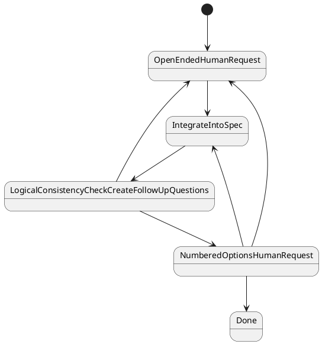

# App Builder Workflow Spec: Spec-Doc Generation FSM (v1)

## 1) Purpose

Define a finite state machine workflow that converts an open-ended human request into an implementation-ready specification document.

This document describes the first workflow in a planned series of app/feature builder workflows.

## 2) Scope

In scope:
- one workflow: `app-builder.spec-doc.v1`
- iterative clarification loop
- spec integration and logical consistency checks
- completion when the spec is implementation-ready

Out of scope:
- implementation of interactive user-feedback transport in `workflow-app-builder`
- UI for review/approval
- runtime server orchestration details beyond required dependency contracts

## 3) Planned Workflow Series (initial)

Only the first workflow is specified now.

1. `app-builder.spec-doc.v1` (this doc)
2. Future: implementation-plan generation workflow
3. Future: code-generation execution workflow
4. Future: validation/refinement workflow

## 4) Workflow Identity

- `workflowType`: `app-builder.spec-doc.v1`
- `workflowVersion`: `1.0.0`
- package: `workflow-app-builder`
- primary dependency workflow: `app-builder.copilot.prompt.v1`

## 5) Intent and Inputs/Outputs

## 5.1 Input Contract

```ts
export interface SpecDocGenerationInput {
  request: string;
  targetPath?: string;
  constraints?: string[];
  maxClarificationLoops?: number; // default 5
  copilotPromptOptions?: {
    baseArgs?: string[];
    allowedDirs?: string[];
    timeoutMs?: number;
    cwd?: string;
  };
}
```

## 5.2 Output Contract

```ts
export interface SpecDocGenerationOutput {
  status: "completed";
  specPath: string;
  summary: {
    loopsUsed: number;
    unresolvedQuestions: 0;
  };
  artifacts: {
    integrationPasses: number;
    consistencyCheckPasses: number;
  };
}
```

## 6) State Machine Definition

## 6.1 Canonical Flow (sample)



## 6.2 State Semantics

1. `OpenEndedHumanRequest`
   - Capture free-form clarifications from the user.
   - Used when ambiguity is high or options are not yet known.

2. `IntegrateIntoSpec`
   - Merge latest human answer(s) into working spec draft.
   - Preserve prior accepted decisions unless explicitly overridden.

3. `LogicalConsistencyCheckCreateFollowUpQuestions`
   - Validate internal consistency of scope, constraints, contracts, and acceptance criteria.
   - Generate follow-up questions when inconsistencies or missing decisions are detected.
  - When no logical consistency issues remain, route to `NumberedOptionsHumanRequest` to ask whether the spec is done or needs additional implementation detail.

4. `NumberedOptionsHumanRequest`
   - Request user selection among explicit choices.
  - Used when decision branches are clear and mutually exclusive.
  - Used both for resolving logical consistency issues and for explicit completion confirmation.

5. `Done`
   - Terminal state.
   - Spec is internally consistent and implementation-ready under current constraints.

## 6.3 Transition Rules and Guards

- `OpenEndedHumanRequest -> IntegrateIntoSpec`
  - Guard: user input received.
- `IntegrateIntoSpec -> LogicalConsistencyCheckCreateFollowUpQuestions`
  - Guard: integration pass complete.
- `LogicalConsistencyCheckCreateFollowUpQuestions -> NumberedOptionsHumanRequest`
  - Guard: unresolved decisions can be represented as explicit options, or consistency checks pass and user completion confirmation is required.
- `LogicalConsistencyCheckCreateFollowUpQuestions -> OpenEndedHumanRequest`
  - Guard: unresolved ambiguity requires exploratory prompt.
- `NumberedOptionsHumanRequest -> IntegrateIntoSpec`
  - Guard: user selected numbered options that require spec updates.
- `NumberedOptionsHumanRequest -> OpenEndedHumanRequest`
  - Guard: user requests additional implementation details not covered by existing options.
- `NumberedOptionsHumanRequest -> Done`
  - Guard: user explicitly confirms spec is done.

## 7) Dependency on `app-builder.copilot.prompt.v1`

This workflow is primarily an orchestration layer that composes repeated calls to `app-builder.copilot.prompt.v1` for:
- drafting and revising spec sections,
- generating follow-up questions,
- running consistency-check prompts,
- producing final implementation-ready markdown.

`app-builder.spec-doc.v1` must not re-implement Copilot ACP protocol details; it delegates prompt execution to `app-builder.copilot.prompt.v1`.

For deterministic orchestration, every `app-builder.copilot.prompt.v1` call in this workflow must provide `outputSchema` and parse `structuredOutput` instead of branching from unstructured text.

## 7.1 Required Output Schemas

Schema artifacts for this workflow:
- `packages/workflow-app-builder/docs/schemas/spec-doc/spec-integration-output.schema.json`
- `packages/workflow-app-builder/docs/schemas/spec-doc/consistency-check-output.schema.json`
- `packages/workflow-app-builder/docs/schemas/spec-doc/spec-doc-generation-output.schema.json`

Minimum usage contract by FSM state:
- `IntegrateIntoSpec`
  - `outputSchema` must use `spec-integration-output.schema.json`.
  - `structuredOutput.specPath` is the markdown file path for the updated working draft.
- `LogicalConsistencyCheckCreateFollowUpQuestions`
  - `outputSchema` must use `consistency-check-output.schema.json`.
  - `structuredOutput.nextState` is the single source of truth for transition routing.
  - `structuredOutput.followUpQuestion` provides payload for either open-ended or numbered-options feedback request.
- `Done`
  - terminal payload must conform to `spec-doc-generation-output.schema.json`.

File output rule:
- The generated spec artifact is a markdown file on disk (`*.md`).
- Schemas must validate routing/metadata contracts and file references, not embed full spec body text.

Transition mapping from structured consistency output:
- if `nextState === "OpenEndedHumanRequest"`: transition to `OpenEndedHumanRequest`.
- if `nextState === "NumberedOptionsHumanRequest"`: transition to `NumberedOptionsHumanRequest`.

Transition mapping from numbered-options response:
- if user selects completion confirmation option: transition to `Done`.
- if user selects option(s) requiring edits: transition to `IntegrateIntoSpec`.
- if user indicates additional open-ended direction: transition to `OpenEndedHumanRequest`.

Numbered-options prompt requirements:
- For completion-confirmation prompts (no logical consistency blockers), options must include at least:
  - one explicit "spec is done" option,
  - one explicit "needs more implementation detail" option.

Validation behavior:
- If `structuredOutput` is not valid JSON, fail the run.
- If JSON is valid but does not satisfy the required schema for the current state, fail the run with schema-validation error details.

## 8) Human Feedback Collection Boundary (Decoupling Requirement)

Human feedback transport/orchestration is currently unsolved for server execution and must be modeled as a server-level default workflow capability.

Required boundary:
- `workflow-app-builder` depends on an abstract “request human feedback / await response” contract.
- concrete implementation lives in server/runtime orchestration and server spec.
- changes to feedback transport, waiting semantics, or timeout/escalation policy must not require edits in `workflow-app-builder` workflows.

Server-spec placement requirement:
- introduce/maintain feedback orchestration behavior in `docs/typescript-server-workflow-spec.md` (not in app-builder package internals).

## 9) Minimum Observability Requirements

Per run, emit events for:
- entering each FSM state,
- question generated (open-ended vs numbered-options),
- user response received,
- spec integration pass completed,
- consistency-check outcome,
- terminal completion.

All events should include `runId`, `workflowType`, `state`, and sequence ordering consistent with shared runtime contracts.

## 10) Completion Criteria (for workflow execution)

`Done` is valid only when all are true:
- scope/objective section is present,
- non-goals are present,
- constraints/assumptions are explicit,
- interfaces/contracts are defined where needed,
- acceptance criteria are testable,
- no unresolved blocking questions remain,
- user explicitly confirms completion from `NumberedOptionsHumanRequest`.

## 10.1 Invariants (Implementation/Test)

- `Done` is reachable only from `NumberedOptionsHumanRequest`.
- `LogicalConsistencyCheckCreateFollowUpQuestions` never transitions directly to `Done`.
- Consistency-check structured output `nextState` is limited to `OpenEndedHumanRequest | NumberedOptionsHumanRequest`.
- If `isImplementationReady === true`, consistency output must route to `NumberedOptionsHumanRequest` with no blocking issues.
- Completion confirmation is explicit user intent selected in `NumberedOptionsHumanRequest`.
- Terminal completed output must satisfy:
  - `status === "completed"`
  - `specPath` ends with `.md`
  - `summary.unresolvedQuestions === 0`

## 11) Failure and Exit Conditions

- If clarification loop exceeds `maxClarificationLoops`, fail with explicit unresolved-question summary.
- If delegated Copilot prompt workflow fails, propagate failure with stage context.
- If human feedback times out/cancels (per server policy), transition to failed/cancelled according to server lifecycle rules.

## 12) Implementation Notes

- Keep this workflow declarative with explicit states/transitions metadata.
- Preserve generator-friendly metadata for future code generation alignment.
- Do not couple to transport details for human interaction.
- Use schema-validated `structuredOutput` for all state branching and completion payload construction.
