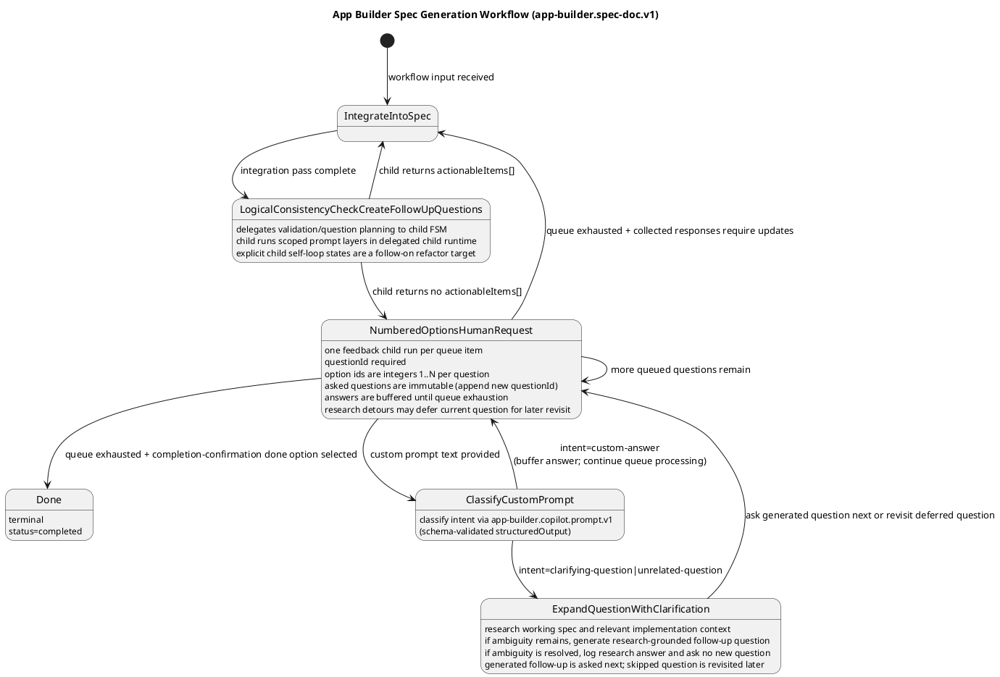

# App Builder Workflow Spec: Spec-Doc Generation FSM (v1)

## 1) Purpose

### Objective

Define a finite state machine workflow that converts an initial human request into an implementation-ready specification document and iteratively refines that document until it is ready for implementation.

This document describes the first workflow in a planned series of app/feature builder workflows.

## 2) Scope

In scope:
- one workflow: `app-builder.spec-doc.v1`
- iterative clarification loop
- spec integration and logical consistency checks
- delegation from `LogicalConsistencyCheckCreateFollowUpQuestions` to an internal child workflow FSM that can return immediate actionable items or numbered follow-up questions
- completion when the spec is implementation-ready

### Non-Goals
- implementation of interactive user-feedback transport in `workflow-app-builder`
- UI for review/approval
- runtime server orchestration details beyond required dependency contracts
- runtime-configurable prompt layering for consistency/follow-up generation in MVP

### Constraints and Assumptions
- `LogicalConsistencyCheckCreateFollowUpQuestions` remains a parent FSM state but delegates its substantive validation/question-generation work to an internal child workflow FSM.
- The child workflow executes an ordered hardcoded prompt-layer array in code; adding another validation/question-generation layer must only require appending a new entry to that array.
- The child workflow should model prompt-layer execution as real child-FSM state transitions rather than an in-memory loop inside a single `start` handler.
- Parent-state branching is limited to: `IntegrateIntoSpec -> LogicalConsistencyCheckCreateFollowUpQuestions`, then `LogicalConsistencyCheckCreateFollowUpQuestions -> IntegrateIntoSpec` when immediate actionable items exist, otherwise `LogicalConsistencyCheckCreateFollowUpQuestions -> NumberedOptionsHumanRequest`.
- The parent FSM change surface is intentionally minimal: prompt-layer execution, issue splitting, and follow-up generation remain child-owned implementation details rather than new parent states or parent-managed prompt sequencing.
- Immediate actionable items are integration directives that do not require a new human decision and must be applied before asking more numbered questions.
- If the child returns no actionable items, existing numbered-options behavior remains authoritative, including workflow-synthesized completion confirmation when no follow-up questions remain.

## 3) Planned Workflow Series (initial)

Only the first workflow is specified now.

1. `app-builder.spec-doc.v1` (this doc)
2. Future: implementation-plan generation workflow
3. Future: code-generation execution workflow
4. Future: validation/refinement workflow

## 4) Workflow Identity

- `workflowType`: `app-builder.spec-doc.v1`
- `workflowVersion`: `1.0.0`
- package: `workflow-app-builder`
- primary dependency workflow: `app-builder.copilot.prompt.v1`
- internal child workflow: `app-builder.spec-doc.consistency-follow-up.v1`
- child workflow purpose: layered validation and follow-up planning for `LogicalConsistencyCheckCreateFollowUpQuestions`

## 5) Interfaces and Contracts

## 5.1 Input Contract

```ts
export interface SpecDocGenerationInput {
  request: string;
  targetPath?: string;
  constraints?: string[];
  copilotPromptOptions?: {
    baseArgs?: string[];
    logDir?: string;
    allowedDirs?: string[];
    timeoutMs?: number; // default: 1_200_000 (20 minutes)
    cwd?: string;
  };
}
```

## 5.2 Output Contract

```ts
export interface SpecDocGenerationOutput {
  status: "completed";
  specPath: string;
  summary: {
    unresolvedQuestions: 0;
  };
  artifacts: {
    integrationPasses: number;
    consistencyCheckPasses: number;
  };
}
```

## 5.3 Delegated Consistency / Follow-Up Child Contracts

`LogicalConsistencyCheckCreateFollowUpQuestions` delegates to an internal child workflow FSM and bases all post-delegation behavior on that child result.

Child input contract:

```ts
export interface ConsistencyFollowUpChildInput {
  request: string;
  specPath: string;
  constraints: string[];
  loopCount: number;
  remainingQuestionIds: string[];
}
```

Input rules:
- `specPath` must point to the latest working draft emitted by the most recent `IntegrateIntoSpec` pass.
- `remainingQuestionIds` is the ordered list of unresolved numbered question ids still known from the latest integration metadata; pass an empty array when none remain.
- `loopCount` is the parent workflow's current consistency-check pass counter and is forwarded unchanged to every executed child prompt layer in that pass.

Child output contract:

```ts
export interface SpecActionableItem {
  itemId: string;
  instruction: string;
  rationale: string;
  targetSection?: string;
  blockingIssueIds: string[];
}

export interface ConsistencyCheckOutput {
  blockingIssues: Array<{
    id: string;
    description: string;
    severity: "low" | "medium" | "high";
    section?: string;
  }>;
  actionableItems: SpecActionableItem[];
  followUpQuestions: NumberedQuestionItem[];
  readinessChecklist: {
    hasScopeAndObjective: boolean;
    hasNonGoals: boolean;
    hasConstraintsAndAssumptions: boolean;
    hasInterfacesOrContracts: boolean;
    hasTestableAcceptanceCriteria: boolean;
    hasNoContradictions: boolean;
    hasSufficientDetail: boolean;
  };
}

export type ConsistencyChecklistKey = keyof ConsistencyCheckOutput["readinessChecklist"];

export interface ConsistencyStageOutput<
  TChecklistKey extends ConsistencyChecklistKey = ConsistencyChecklistKey,
> {
  blockingIssues: ConsistencyCheckOutput["blockingIssues"];
  actionableItems: SpecActionableItem[];
  followUpQuestions: NumberedQuestionItem[];
  readinessChecklist: Pick<ConsistencyCheckOutput["readinessChecklist"], TChecklistKey>;
}
```

Contract rules:
- `ConsistencyCheckOutput` is the aggregate child-result contract consumed by the parent after the child finishes merging all executed stages.
- Each scoped prompt layer must use a narrower stage-specific schema representing `ConsistencyStageOutput<OwnedChecklistKeys>` rather than the full aggregate contract.
- A stage-specific schema must expose only that layer's owned `readinessChecklist` keys and must not require unrelated checklist fields from other layers.
- Parent state transition logic after delegation must use only this child output contract; it must not branch from raw model text.
- The child is solely responsible for classifying each surfaced issue as either an immediate actionable item, a human follow-up question, or already-resolved/no-output for that pass.
- `actionableItems` and `followUpQuestions` are mutually exclusive in the aggregate child result. If `actionableItems.length > 0`, `followUpQuestions` must be empty.
- `actionableItems` is ordered and must contain only edits that `IntegrateIntoSpec` can apply without asking the human for another decision.
- `followUpQuestions` is ordered and must contain only questions that require human input through `NumberedOptionsHumanRequest`.
- An empty `actionableItems` array and empty `followUpQuestions` array means no new integration work or human decision is required; parent workflow logic then synthesizes a completion-confirmation numbered question.
- Duplicate `itemId` or `questionId` values anywhere in one child run across all executed stages are contract violations and must fail the run rather than being silently deduplicated.
- `blockingIssues` is an ordered diagnostic/audit surface for the executed child run; the parent may persist or log it, but parent routing is driven only by `actionableItems` vs `followUpQuestions`.

## 6) State Machine Definition

## 6.1 Canonical Flow (sample)



## 6.2 State Semantics

1. `IntegrateIntoSpec`
   - Merge latest human answer(s) or immediate action item(s) into the working spec draft.
   - Initial pass integrates `SpecDocGenerationInput` from workflow start (no dedicated feedback start state).
   - Subsequent passes integrate accumulated normalized numbered-options responses after queue exhaustion or child-generated actionable items from consistency/follow-up analysis.
   - Preserve prior accepted decisions unless explicitly overridden.

2. `LogicalConsistencyCheckCreateFollowUpQuestions`
   - Parent orchestration state only; it does not directly author follow-up questions.
   - Delegates to child workflow `app-builder.spec-doc.consistency-follow-up.v1`.
   - Consumes only the child workflow aggregate result contract (`actionableItems[]`, `followUpQuestions[]`, `blockingIssues[]`, `readinessChecklist`).
   - Must not inspect per-layer prompt output or sequence prompt layers itself; those responsibilities stay inside the child FSM.
   - Routes to `IntegrateIntoSpec` when the child returns immediate actionable items.
   - Routes to `NumberedOptionsHumanRequest` when the child returns no actionable items; returned numbered questions are asked as-is, and empty question output still triggers synthesized completion confirmation.

3. `NumberedOptionsHumanRequest`
   - Request user selection among explicit choices.
   - Used when decision branches are clear and mutually exclusive.
   - If multiple numbered follow-up questions exist, this state self-loops question-by-question until all answers are captured.
   - User may answer by selecting numbered options or by providing a custom prompt; responses are accumulated until the numbered queue is exhausted.
   - If custom prompt text is provided, route through `ClassifyCustomPrompt`; classification results return to numbered-options processing.
   - If custom prompt text is classified as a research question rather than an answer, the current numbered question is deferred and revisited after the research detour completes.
   - If no unresolved questions remain, this state asks explicit completion confirmation (`Done` vs additional work for `IntegrateIntoSpec`).

4. `ClassifyCustomPrompt`
   - Uses `app-builder.copilot.prompt.v1` with schema-validated `structuredOutput` to classify custom prompt intent as `clarifying-question`, `unrelated-question`, or `custom-answer`.
   - `clarifying-question` means the user is asking for information needed to answer the current numbered question.
  - Questions about the current spec draft, repository, or implementation still count as `clarifying-question` when that research is being used to answer the current numbered question.
   - `unrelated-question` means the user is requesting research on the spec or implementation that is not itself an answer to the current numbered question.
   - For either question intent, `structuredOutput.customQuestionText` is the normalized text handed to `ExpandQuestionWithClarification`.
   - Does not transition directly to `IntegrateIntoSpec`; `custom-answer` returns to `NumberedOptionsHumanRequest`, while question intents transition to `ExpandQuestionWithClarification`.

5. `ExpandQuestionWithClarification`
   - Performs research against the current spec draft and relevant implementation/workspace context before deciding whether another human question is required.
   - For `clarifying-question`, research is scoped to resolving ambiguity in the current numbered question.
   - For `unrelated-question`, research answers the user's side question without treating it as an answer to the current numbered question.
  - If the same source numbered question asks the same normalized research question again, the workflow reuses the existing `researchNotes[]` result instead of delegating the same research repeatedly.
   - If research reveals a remaining ambiguity or decision gap, materializes a research-grounded follow-up question, appends a new immutable queue item with a new `questionId`, and inserts it as the immediate next question.
   - If research resolves the issue without needing human input, records a research log entry/observability event and returns to numbered-options processing without appending a new queue item.
   - `structuredOutput.researchOutcome` is the single source of truth for whether a follow-up question is required.
   - Research-only results are persisted as `researchNotes[]` state records for audit/observability and are not merged into `IntegrateIntoSpec.answers` unless later echoed in a human answer.
   - Deferred questions are managed as a LIFO revisit stack. When a follow-up question is generated, the source numbered question that triggered the research detour is pushed onto that stack and revisited before the workflow advances to older unresolved items or evaluates terminal queue exhaustion.

6. `Done`
   - Terminal state.
   - Spec is internally consistent and implementation-ready under current constraints.

## 6.2.1 Delegated Child Workflow Semantics

The delegated child workflow for `LogicalConsistencyCheckCreateFollowUpQuestions` is an implementation-owned FSM with the following behavior:
1. It executes `CONSISTENCY_FOLLOW_UP_PROMPT_LAYERS` as an ordered hardcoded array of prompt stages.
2. Each stage uses `app-builder.copilot.prompt.v1` with its own stage-specific output schema that narrows the contract to that layer's concern area and owned `readinessChecklist` keys.
3. Each executed stage is responsible for splitting any issues it finds into either immediate `actionableItems` for `IntegrateIntoSpec` or human `followUpQuestions` for `NumberedOptionsHumanRequest`.
4. The stage-specific schemas must reuse the shared issue/question/actionable-item definitions from the aggregate child contract rather than redefining equivalent shapes independently.
5. Current shipped baseline: the child owns prompt-layer progression internally and may execute the ordered stage list within a single delegated child handler as long as the aggregate contract and short-circuit semantics are preserved.
6. Planned explicit-state refactor target: promote prompt-layer progression into child workflow runtime states `start`, `ExecutePromptLayer`, `Done`, and `failed`, with `ExecutePromptLayer` self-looping once per configured prompt layer.
7. The child evaluates stages in array order and aggregates `blockingIssues` plus readiness-checklist failures from every executed stage into the full `ConsistencyCheckOutput` result.
8. If any executed stage returns one or more `actionableItems`, the child stops before running later stages, returns the accumulated actionable items in stage order, and returns an empty `followUpQuestions` array.
9. If no executed stage returns actionable items, the child aggregates `followUpQuestions` from all executed stages in stage order and returns an empty `actionableItems` array.
10. The parent workflow change is intentionally limited to delegating this work to the child and honoring the child-driven `LogicalConsistencyCheckCreateFollowUpQuestions -> IntegrateIntoSpec` or `-> NumberedOptionsHumanRequest` transition.
11. The child must fail explicitly on duplicate `itemId` or `questionId` values across executed stages.
12. Appending another prompt layer to `CONSISTENCY_FOLLOW_UP_PROMPT_LAYERS` must require only appending a new layer entry, prompt template, and matching narrow stage schema; it must not require any parent-FSM transition changes.
13. Until the explicit-state refactor lands, the current baseline must still preserve equivalent ordered-stage execution, aggregate result merging, and duplicate-detection semantics within a single child run.
14. After the explicit-state refactor lands, `ExecutePromptLayer` becomes the only looping child state and persists `stageIndex`, the aggregate result, and duplicate-detection sets across self-loop transitions.
15. After the explicit-state refactor lands, `ExecutePromptLayer` transitions to `failed` for schema validation failures, duplicate ids, or mixed non-empty `actionableItems` plus `followUpQuestions`; otherwise it transitions to `Done` when `actionableItems` is non-empty or the current stage is the last configured stage, or back to `ExecutePromptLayer(stageIndex + 1)` when additional stages remain.

## 6.3 Transition Rules and Guards

- `[*] -> IntegrateIntoSpec`
  - Guard: workflow input is available and validated.
- `IntegrateIntoSpec -> LogicalConsistencyCheckCreateFollowUpQuestions`
  - Guard: integration pass complete.
- `LogicalConsistencyCheckCreateFollowUpQuestions -> IntegrateIntoSpec`
  - Guard: delegated child result contains one or more actionable items that can be applied without human input.
- `LogicalConsistencyCheckCreateFollowUpQuestions -> NumberedOptionsHumanRequest`
  - Guard: delegated child result contains zero actionable items; returned follow-up questions may be non-empty or empty.
- `NumberedOptionsHumanRequest -> NumberedOptionsHumanRequest`
  - Guard: additional numbered follow-up questions remain to be asked and answered, and no custom prompt text is provided with the current response.
- `NumberedOptionsHumanRequest -> IntegrateIntoSpec`
  - Guard: numbered queue is exhausted and collected responses (selected options and/or custom-answer text) require spec updates.
- `NumberedOptionsHumanRequest -> ClassifyCustomPrompt`
  - Guard: custom prompt text is provided with current response (takes precedence over direct queue self-loop evaluation for that response).
- `ClassifyCustomPrompt -> NumberedOptionsHumanRequest`
  - Guard: intent is custom-answer, so answer is buffered and queue processing continues.
- `ClassifyCustomPrompt -> ExpandQuestionWithClarification`
  - Guard: intent is clarifying-question or unrelated-question.
- `ExpandQuestionWithClarification -> NumberedOptionsHumanRequest`
  - Guard: research has completed; either a follow-up question has been materialized and inserted as immediate next queue item, or a research-only answer has been logged and numbered-options processing can resume.
- `NumberedOptionsHumanRequest -> Done`
  - Guard: numbered queue is exhausted and completion-confirmation done option is selected.

## 6.4 NumberedOptionsHumanRequest Implementation Detail (MVP)

Execution model:
- This state is implemented as a deterministic question queue processor.
- Input queue is created from the delegated child workflow result returned by `LogicalConsistencyCheckCreateFollowUpQuestions` when `actionableItems` is empty and stored in workflow context/state data.
- The state must not be entered for a consistency-check pass that returned `actionableItems`; that pass goes directly to `IntegrateIntoSpec`.
- Each queue item is a numbered-options question with stable `questionId`, `prompt`, and `options[]`.
- Within each question, option IDs are unique contiguous integers starting at `1`.

Question queue construction:
- If the child returns unresolved human-decision items, enqueue one or more returned numbered questions in child-provided order.
- If the child returns zero `actionableItems` and zero `followUpQuestions`, workflow logic must synthesize a completion-confirmation numbered question that includes an explicit "spec is done" option.
- Canonical completion option IDs are not required; done is interpreted from the selected option as authored for that specific question.
- Each generated option should include concise pros/cons to help user decision-making (use option `description` with a clear `Pros:` / `Cons:` format).
- Queue order must be stable across retries/recovery (deterministic ordering by generated `questionId`).
- Clarification-generated follow-up questions must be inserted as the immediate next queue item (ahead of older unresolved items) to avoid context switching.
- When a research detour is triggered from the current queue item, that source question becomes deferred rather than completed unless a valid numbered answer was actually provided.
- Deferred source questions must be tracked on a LIFO revisit stack.
- Before the queue processor advances to older unresolved items or treats the queue as exhausted, it must revisit the most recently deferred source question.
- A source question must not be deferred more than once at the same time; repeated research detours while it is already deferred reuse the existing deferred entry.

Per-question execution:
- For the current queue item, request human feedback through the server-owned feedback workflow.
- Launch one feedback child run per queue item (no batching of multiple questions into one feedback run).
- Populate `HumanFeedbackRequestInput.questionId` with the queue item's stable `questionId` when launching each feedback request.
- The idempotency key for each feedback child run must include both the consistency-check pass number and the per-question feedback attempt number so cached responses are not replayed across later passes or deferred re-asks of the same question. Format: `spec-doc:feedback:{runId}:{questionId}:pass-{consistencyCheckPasses}:attempt-{feedbackAttempt}`.
- Expect server feedback projection persistence to store the stable `HumanFeedbackRequestInput.questionId` value as `human_feedback_requests.question_id` for question-level diagnostics and replay correlation; the idempotency key remains a separate replay-control mechanism.
- Accept response payload with `selectedOptionIds?: number[]` and optional `text?: string` custom prompt.
- Treat invalid `selectedOptionIds` as request-validation errors from the feedback API (no answer recorded; question remains pending until valid response).
- Feedback responses must include either one selected option or non-empty custom text.
- For completion-confirmation questions, zero-or-one selected options are allowed; multi-select responses are request-validation errors.
- Assume no protocol-level max for custom `text` in MVP; handle any implementation-local validation errors as retryable feedback submission failures.
- Persist normalized answer record in state data when the current numbered question actually receives an answer:
  - `questionId`,
  - `selectedOptionIds` (possibly empty),
  - `text` (possibly empty),
  - `answeredAt` timestamp.
- If custom text is classified as `clarifying-question` or `unrelated-question` and no answer has been given for the current numbered item, do not mark that item answered; instead persist a `researchNotes[]` entry and defer the numbered question for later revisit.
- Each time a numbered question is deferred for a research detour, increment that question's feedback attempt counter so its later revisit creates a fresh feedback request rather than replaying the previous responded child.

Research note persistence:
- Research-only outcomes are stored separately from normalized answers as `researchNotes[]` entries with:
  - `sourceQuestionId`,
  - `intent`,
  - `questionText`,
  - `researchSummary`,
  - `recordedAt` timestamp.
- Repeated clarification lookups for the same `sourceQuestionId` and normalized `questionText` reuse the existing `researchNotes[]` entry instead of creating a duplicate delegation.
- `researchNotes[]` is for auditability and observability, not direct spec integration input.

Custom prompt handling:
- Custom prompt text is additive context, not a replacement for numbered options.
- Custom prompt intent classification (`clarifying-question` vs `unrelated-question` vs `custom-answer`) is delegated to `app-builder.copilot.prompt.v1`.
- Classification must be derived from schema-validated `structuredOutput` (not ad-hoc local heuristics) before choosing the next transition.
- Example: alternative answer text augments selected option intent, is buffered with the current answer set, and is carried into `IntegrateIntoSpec` after queue exhaustion.
- Example: a clarifying question first triggers research against the spec and implementation; if the research still leaves an ambiguity, a new numbered follow-up queue item is inserted next and the original source question is revisited later.
- Example: an unrelated research question may produce only a logged research answer and no new queue item; numbered-options processing then returns to the deferred source question.
- Question-intent outputs use `customQuestionText` as the normalized payload passed into research.
- Asked numbered-options questions are immutable once issued; research-generated follow-ups must append a new queue item with a new `questionId`.

Transition resolution after each response:
- If custom prompt text is provided, transition to `ClassifyCustomPrompt` first for intent classification.
- If custom prompt intent is clarifying-question or unrelated-question, transition to `ExpandQuestionWithClarification` and defer the source numbered question unless it already has a valid answer.
- If `ExpandQuestionWithClarification.structuredOutput.researchOutcome === "resolved-with-research"`, log or reuse the research answer and transition to `NumberedOptionsHumanRequest`; the most recently deferred source question becomes the next item to revisit.
- If `ExpandQuestionWithClarification.structuredOutput.researchOutcome === "needs-follow-up-question"`, insert the schema-validated `followUpQuestion` as immediate next, transition to `NumberedOptionsHumanRequest`, ask that generated question next, and revisit the deferred source question when the inserted follow-up chain completes.
- If custom prompt intent is custom-answer, buffer it and continue numbered queue processing.
- If unasked queue items remain and no custom prompt text is pending classification, transition to `NumberedOptionsHumanRequest` (self-loop).
- If no unasked queue items remain but deferred questions remain on the revisit stack, transition to `NumberedOptionsHumanRequest` and revisit the most recently deferred source question instead of evaluating terminal exhaustion.
- If queue is exhausted, deferred-question stack is empty, and completion-confirmation indicates done by selecting its explicit done option, transition to `Done`.
- Otherwise transition to `IntegrateIntoSpec` with accumulated normalized answers (including buffered custom-answer prompts) as integration input.

Re-entry with exhausted queue:
- `NumberedOptionsHumanRequest` may be re-entered from `ClassifyCustomPrompt` (custom-answer) or `ExpandQuestionWithClarification` with `queueIndex >= queue.length`.
- When entered with an exhausted queue, the handler must not fail. Instead it evaluates queue-exhaustion transitions using the already-recorded answers:
- If deferred questions remain on the revisit stack, queue exhaustion is not final; the handler must resume with the most recently deferred source question.
  - Resuming a deferred question must launch a fresh feedback child request for that revisit attempt, even when the `questionId` and consistency-check pass are unchanged.
- If no deferred questions remain and any answered item is the completion-confirmation question with the done option selected (option 1), transition to `Done`.
- Otherwise, transition to `IntegrateIntoSpec` with accumulated normalized answers.

## 6.5 IntegrateIntoSpec Input Contract (MVP)

`IntegrateIntoSpec` consumes a normalized state input that supports initial draft creation, immediate consistency-driven edits, and later feedback-driven updates.

```ts
export interface IntegrateIntoSpecInput {
  source: "workflow-input" | "numbered-options-feedback" | "consistency-action-items";
  request: string;
  targetPath?: string;
  constraints?: string[];
  specPath?: string;
  answers?: Array<{
    questionId: string;
    selectedOptionIds: number[];
    text?: string;
    answeredAt: string; // ISO-8601 timestamp
  }>;
  actionableItems?: Array<{
    itemId: string;
    instruction: string;
    rationale: string;
    targetSection?: string;
    blockingIssueIds: string[];
  }>;
}
```

Contract notes:
- `source: "workflow-input"` is used for the first pass and carries workflow input fields.
- `source: "numbered-options-feedback"` is used after numbered queue exhaustion when accumulated responses require spec updates.
- `source: "consistency-action-items"` is used immediately after `LogicalConsistencyCheckCreateFollowUpQuestions` when the delegated child returns `actionableItems`.
- `answers` is optional for initial and consistency-action-item passes and, when present, is the normalized answer record accumulated in `NumberedOptionsHumanRequest`.
- `actionableItems` is required when `source === "consistency-action-items"` and must be applied in array order as concrete edit directives for the current spec pass.
- `specPath` allows integration into an existing working draft path from prior passes.

## 7) Dependency on `app-builder.copilot.prompt.v1`

This workflow is primarily an orchestration layer that composes repeated calls to `app-builder.copilot.prompt.v1` for:
- drafting and revising spec sections,
- running the delegated child's layered consistency/follow-up prompts,
- generating child-owned follow-up questions when immediate integration is not possible,
- producing final implementation-ready markdown.

`app-builder.spec-doc.v1` must not re-implement Copilot ACP protocol details; it delegates prompt execution to `app-builder.copilot.prompt.v1`.

For deterministic orchestration, every `app-builder.copilot.prompt.v1` call in this workflow must provide `outputSchema` and parse `structuredOutput` instead of branching from unstructured text.

## 7.1 Required Schemas

Schema artifacts for this workflow:
- `packages/workflow-app-builder/docs/schemas/spec-doc/numbered-question-item.schema.json`
- `packages/workflow-app-builder/docs/schemas/spec-doc/spec-integration-input.schema.json`
- `packages/workflow-app-builder/docs/schemas/spec-doc/spec-integration-output.schema.json`
- `packages/workflow-app-builder/docs/schemas/spec-doc/consistency-check-output.schema.json`
- `packages/workflow-app-builder/docs/schemas/spec-doc/consistency-scope-objective-output.schema.json`
- `packages/workflow-app-builder/docs/schemas/spec-doc/consistency-non-goals-output.schema.json`
- `packages/workflow-app-builder/docs/schemas/spec-doc/consistency-constraints-assumptions-output.schema.json`
- `packages/workflow-app-builder/docs/schemas/spec-doc/consistency-interfaces-contracts-output.schema.json`
- `packages/workflow-app-builder/docs/schemas/spec-doc/consistency-acceptance-criteria-output.schema.json`
- `packages/workflow-app-builder/docs/schemas/spec-doc/consistency-contradictions-completeness-output.schema.json`
- `packages/workflow-app-builder/docs/schemas/spec-doc/custom-prompt-classification-output.schema.json`
- `packages/workflow-app-builder/docs/schemas/spec-doc/clarification-follow-up-output.schema.json`
- `packages/workflow-app-builder/docs/schemas/spec-doc/spec-doc-generation-output.schema.json`

Schema ownership boundary:
- `packages/workflow-app-builder/docs/schemas/spec-doc/numbered-question-item.schema.json` extends the server-owned base envelope in `packages/workflow-server/docs/schemas/human-input/numbered-question-item.schema.json` by adding app-builder-specific `kind` semantics.
- Numbered response transport validation remains server-owned via `packages/workflow-server/docs/schemas/human-input/numbered-options-response-input.schema.json`.
- `consistency-check-output.schema.json` is the aggregate child-result contract consumed by the parent FSM after the child merges all executed layers.
- Each `consistency-*-output.schema.json` file is a layer-local prompt contract that exposes only the current layer's owned `readinessChecklist` keys while reusing shared item/question/actionable-item definitions.

Minimum usage contract by FSM state:
- `IntegrateIntoSpec`
  - `inputSchema` must use `spec-integration-input.schema.json`.
  - `outputSchema` must use `spec-integration-output.schema.json`.
  - `structuredOutput.specPath` is the markdown file path for the updated working draft.
- `LogicalConsistencyCheckCreateFollowUpQuestions`
  - must launch internal child workflow `app-builder.spec-doc.consistency-follow-up.v1`.
  - each executed prompt layer in that child must use its matching `consistency-*-output.schema.json` stage schema rather than the aggregate child schema.
  - after stage outputs are merged, the child aggregate result must satisfy `consistency-check-output.schema.json` before the parent consumes it.
  - the child aggregate result exposes `structuredOutput.actionableItems` and `structuredOutput.followUpQuestions`.
  - `structuredOutput.actionableItems` provides deterministic ordered immediate integration directives and may be empty.
  - `structuredOutput.followUpQuestions` is authoritative only when `structuredOutput.actionableItems` is empty; each queue item must conform to `numbered-question-item.schema.json` with `kind: "issue-resolution"`.
  - if both arrays are empty, workflow logic synthesizes one completion-confirmation queue item with an explicit "spec is done" option before entering `NumberedOptionsHumanRequest`.
- `ClassifyCustomPrompt`
  - `outputSchema` must use `custom-prompt-classification-output.schema.json`.
  - `structuredOutput.intent` is the single source of truth for intent routing (`clarifying-question` vs `unrelated-question` vs `custom-answer`).
  - For question intents, `structuredOutput.customQuestionText` is required and is forwarded unchanged into `ExpandQuestionWithClarification`.
- `ExpandQuestionWithClarification`
  - `outputSchema` must use `clarification-follow-up-output.schema.json`.
  - `structuredOutput.researchOutcome` is the single source of truth for branch selection (`resolved-with-research` vs `needs-follow-up-question`).
  - `structuredOutput.researchSummary` is required and must summarize the research grounded in the current spec and relevant implementation context.
  - `structuredOutput.followUpQuestion` is required only when `researchOutcome === "needs-follow-up-question"`; when present it must conform to server-owned base `packages/workflow-server/docs/schemas/human-input/numbered-question-item.schema.json`, workflow logic assigns `kind: "issue-resolution"`, and inserts it as the immediate next queue item.
  - when `researchOutcome === "resolved-with-research"`, workflow logic records a `researchNotes[]` entry and resumes numbered-options processing at the deferred source question.
- `Done`
  - terminal payload must conform to `spec-doc-generation-output.schema.json`.

File output rule:
- The generated spec artifact is a markdown file on disk (`*.md`).
- Schemas must validate routing/metadata contracts and file references, not embed full spec body text.

Transition mapping from delegated consistency-check child result:
- if `actionableItems` is non-empty, transition directly to `IntegrateIntoSpec` with `source: "consistency-action-items"`.
- if `actionableItems` is empty and `followUpQuestions` is empty, synthesize one completion-confirmation numbered question in workflow logic (with explicit "spec is done" option) and enqueue it.
- if `actionableItems` is empty, transition to `NumberedOptionsHumanRequest` (fixed workflow logic, not model-selected state).

Transition mapping from numbered-options response:
- if custom prompt text is provided: transition to `ClassifyCustomPrompt` (evaluate this first for the current response).
- if custom prompt intent is classified as clarifying-question or unrelated-question: transition to `ExpandQuestionWithClarification` and defer the source numbered question unless already answered.
- if `ExpandQuestionWithClarification.researchOutcome === "resolved-with-research"`: log or reuse the research answer and transition to `NumberedOptionsHumanRequest` to revisit the deferred source question.
- if `ExpandQuestionWithClarification.researchOutcome === "needs-follow-up-question"`: insert the related follow-up as immediate next, transition to `NumberedOptionsHumanRequest`, ask it next, then revisit the deferred source question.
- if user selects the completion-confirmation done option and the numbered queue is exhausted: transition to `Done`.
- if custom prompt intent is classified as custom-answer: buffer response and transition to `NumberedOptionsHumanRequest`.
- if user selects non-completion numbered option(s) while questions remain: record response and transition to `NumberedOptionsHumanRequest`.
- if additional numbered follow-up questions remain and no custom prompt text is provided: transition to `NumberedOptionsHumanRequest`.
- if queue is exhausted, deferred-question stack is empty, and collected responses require updates (including custom-answer text): transition to `IntegrateIntoSpec`.

Numbered-options question requirements:
- For workflow-synthesized completion-confirmation questions, options must include at least one explicit "spec is done" numbered option.
- Completion-confirmation questions do not require canonical/standardized option IDs.
- Numbered option IDs must be unique contiguous integers starting at `1` for each question.
- Numbered-options prompts must allow optional custom prompt text in addition to numbered selections.
- Each option should include decision support details by populating `description` with concise `Pros:` and `Cons:` bullets.

Validation behavior:
- `app-builder.copilot.prompt.v1` validates `structuredOutput` against the provided `outputSchema` using Ajv2020 before accepting the result.
- If `structuredOutput` is not valid JSON **or** is valid JSON that does not satisfy the `outputSchema`, the entire copilot ACP execution is retried (up to 3 total attempts: 1 initial + 2 retries).
- Each retry attempt emits a warn-level log containing the validation error from the previous attempt.
- If all attempts are exhausted without producing schema-valid output, the run fails with schema-validation error details aggregated from the final attempt.

## 7.2 Hardcoded Copilot Prompt Templates (MVP)

This workflow and its delegated consistency/follow-up child should use fixed prompt templates (versioned in code) for each state or child-stage that delegates to `app-builder.copilot.prompt.v1`.

Prompt-template rules:
- Prompt bodies are hardcoded string literals; runtime provides only variable interpolation data.
- Every template below must be paired with the state-specific `outputSchema` from section 7.1.
- `app-builder.copilot.prompt.v1` is responsible for issuing the schema follow-up prompt when `outputSchema` is provided; templates below are task prompts, not schema-instruction prompts.
- The workflow must branch only from schema-validated `structuredOutput`.
- All IDs and list ordering must be deterministic for identical inputs.
- Prompt text should describe model task intent only; transition/routing authority remains in workflow logic + schema validation.
- `LogicalConsistencyCheckCreateFollowUpQuestions` child prompt layering must be defined by an ordered hardcoded array in implementation, not by runtime configuration.

### 7.2.1 `IntegrateIntoSpec` prompt (`spec-doc.integrate.v1`)

Usage:
- state: `IntegrateIntoSpec`
- output schema: `spec-integration-output.schema.json`

Required runtime interpolation variables:
- `{{request}}`
- `{{source}}` (`workflow-input`, `numbered-options-feedback`, or `consistency-action-items`)
- `{{targetPath}}` (optional)
- `{{constraintsJson}}` (JSON array)
- `{{specPath}}` (optional existing draft path)
- `{{answersJson}}` (JSON array of normalized answers; optional/empty on first pass)
- `{{actionableItemsJson}}` (JSON array of immediate action items; optional/empty unless source is `consistency-action-items`)

Prompt text:

```text
You are generating and maintaining an implementation-ready software specification markdown document.

You must:
1) Preserve prior accepted decisions unless explicitly overridden by newer answers.
2) Integrate all provided constraints, normalized numbered-options answers, and immediate actionable items.
3) Keep the spec concrete and testable.
4) Ensure sections exist for: objective/scope, non-goals, constraints/assumptions, interfaces/contracts, acceptance criteria.
5) Write or update the markdown file in the workspace.

Input context:
- source: {{source}}
- request: {{request}}
- targetPath: {{targetPath}}
- existingSpecPath: {{specPath}}
- constraints: {{constraintsJson}}
- answers: {{answersJson}}
- actionableItems: {{actionableItemsJson}}

Spec quality requirements:
- No unresolved contradictions in scope, constraints, or interface contracts.
- Acceptance criteria must be testable and unambiguous.
- Keep language implementation-ready and avoid vague statements.
- Enough detail to implement without ambiguity.
- When actionableItems are present, treat them as ordered concrete edit directives for the current pass.
```

### 7.2.2 `LogicalConsistencyCheckCreateFollowUpQuestions` scoped prompt templates

The delegated child workflow does not use a single combined consistency prompt. Instead it executes a series of narrower scoped prompts, each paired to its own stage-specific output schema derived from the shared aggregate child contract.

Scoped template IDs:
- `spec-doc.consistency-scope-objective.v1`
- `spec-doc.consistency-non-goals.v1`
- `spec-doc.consistency-constraints-assumptions.v1`
- `spec-doc.consistency-interfaces-contracts.v1`
- `spec-doc.consistency-acceptance-criteria.v1`
- `spec-doc.consistency-contradictions-completeness.v1`

Common runtime interpolation variables:
- `{{request}}`
- `{{specPath}}`
- `{{constraintsJson}}`
- `{{loopCount}}`
- `{{remainingQuestionIdsJson}}` (from latest integration metadata)
- `{{stageId}}`

Common prompt rules:
- Each scoped prompt inspects only its assigned concern area.
- Each scoped prompt receives only the schema surface for its assigned concern area; unrelated checklist booleans and off-topic fields are excluded from that prompt's `outputSchema`.
- Each scoped prompt splits surfaced issues into exactly one of: `actionableItems`, `followUpQuestions`, or no output.
- `actionableItems` and `followUpQuestions` remain mutually exclusive for a single stage output.
- Each stage must return deterministic ordering and only its owned readiness-checklist surface.

### 7.2.2.1 `CONSISTENCY_FOLLOW_UP_PROMPT_LAYERS` implementation contract

```ts
const CONSISTENCY_FOLLOW_UP_PROMPT_LAYERS = [
  {
    stageId: 'scope-objective-consistency',
    templateId: 'spec-doc.consistency-scope-objective.v1',
    outputSchema: 'consistency-scope-objective-output.schema.json',
    checklistKeys: ['hasScopeAndObjective'],
  },
  {
    stageId: 'non-goals-consistency',
    templateId: 'spec-doc.consistency-non-goals.v1',
    outputSchema: 'consistency-non-goals-output.schema.json',
    checklistKeys: ['hasNonGoals'],
  },
  {
    stageId: 'constraints-assumptions-consistency',
    templateId: 'spec-doc.consistency-constraints-assumptions.v1',
    outputSchema: 'consistency-constraints-assumptions-output.schema.json',
    checklistKeys: ['hasConstraintsAndAssumptions'],
  },
  {
    stageId: 'interfaces-contracts-consistency',
    templateId: 'spec-doc.consistency-interfaces-contracts.v1',
    outputSchema: 'consistency-interfaces-contracts-output.schema.json',
    checklistKeys: ['hasInterfacesOrContracts'],
  },
  {
    stageId: 'acceptance-criteria-consistency',
    templateId: 'spec-doc.consistency-acceptance-criteria.v1',
    outputSchema: 'consistency-acceptance-criteria-output.schema.json',
    checklistKeys: ['hasTestableAcceptanceCriteria'],
  },
  {
    stageId: 'contradictions-completeness-consistency',
    templateId: 'spec-doc.consistency-contradictions-completeness.v1',
    outputSchema: 'consistency-contradictions-completeness-output.schema.json',
    checklistKeys: ['hasNoContradictions', 'hasSufficientDetail'],
  },
] as const;
```

Rules:
- The delegated child workflow executes entries in array order.
- Current shipped baseline may execute these entries inside a single delegated child handler; explicit self-loop child-state progression is a planned follow-on refactor.
- The intended child-FSM implementation initializes into `ExecutePromptLayer` once and then self-loops that state once per configured array entry.
- Adding another validation/question-generation layer is an append-only change to this hardcoded array plus its matching narrow output schema; parent transition logic stays unchanged.
- Each appended layer may introduce additional validation or question-generation coverage without changing parent state semantics.
- Every entry must produce its own declared stage-specific output schema, and the child must merge executed stage outputs into the aggregate `consistency-check-output.schema.json` contract before returning.
- Every executed entry receives the shared child input (`request`, `specPath`, `constraints`, `loopCount`, `remainingQuestionIds`) plus its own `stageId`.
- Later stages execute only if all earlier executed stages returned zero `actionableItems`.
- `stageId` values must be unique.
- `outputSchema` values must be unique to their stage intent and must expose only that stage's `checklistKeys` in `readinessChecklist`.
- `checklistKeys` must be non-empty for every configured layer.
- `readinessChecklist` aggregation applies only to the current layer's declared `checklistKeys`; each focused field is merged with logical AND across the executed layers that own that field.

### 7.2.3 `ClassifyCustomPrompt` prompt (`spec-doc.classify-custom-prompt.v1`)

Usage:
- state: `ClassifyCustomPrompt`
- output schema: `custom-prompt-classification-output.schema.json`

Required runtime interpolation variables:
- `{{questionId}}`
- `{{questionPrompt}}`
- `{{selectedOptionIdsJson}}`
- `{{customText}}`

Prompt text:

```text
Classify the user's custom text for a numbered-options response.

Input context:
- questionId: {{questionId}}
- questionPrompt: {{questionPrompt}}
- selectedOptionIds: {{selectedOptionIdsJson}}
- customText: {{customText}}

Classification policy:
- intent = clarifying-question when the custom text is primarily asking for clarification, disambiguation, or additional information needed to answer the current numbered question.
- intent = unrelated-question when the custom text is primarily a side research task about the spec, implementation, or repository and is not itself an answer to the current numbered question.
- intent = custom-answer when the custom text primarily provides an answer, preference, constraint, or detail to be integrated.
- For both question intents, populate `customQuestionText` with the normalized question text that should be researched next.
- Choose exactly one intent.

```

### 7.2.4 `ExpandQuestionWithClarification` prompt (`spec-doc.expand-clarification.v1`)

Usage:
- state: `ExpandQuestionWithClarification`
- output schema: `clarification-follow-up-output.schema.json`

Required runtime interpolation variables:
- `{{request}}`
- `{{specPath}}` (optional existing draft path)
- `{{sourceQuestionId}}`
- `{{sourceQuestionPrompt}}`
- `{{sourceOptionsJson}}`
- `{{customQuestionText}}`
- `{{intent}}` (`clarifying-question` or `unrelated-question`)

Prompt text:

```text
Research the user's question against the current spec draft and relevant implementation context before deciding whether another human question is needed.

Input context:
- request: {{request}}
- specPath: {{specPath}}
- sourceQuestionId: {{sourceQuestionId}}
- sourceQuestionPrompt: {{sourceQuestionPrompt}}
- sourceOptions: {{sourceOptionsJson}}
- customQuestionText: {{customQuestionText}}
- intent: {{intent}}

Rules:
1) Research first; do not merely restate the user's question.
2) The delegated run must have access to the current workflow request, the spec draft at `specPath` when present, and workspace context reachable through the workflow's configured Copilot prompt options (`cwd`, `allowedDirs`).
3) Always return `researchOutcome` and `researchSummary`.
4) If research resolves the question without remaining ambiguity, set `researchOutcome = resolved-with-research` and omit `followUpQuestion`.
5) If research finds a remaining decision or ambiguity that requires human input, set `researchOutcome = needs-follow-up-question` and create exactly one deterministic numbered `followUpQuestion` grounded in the research findings.
6) `followUpQuestion.questionId` must be new and deterministic.
7) `followUpQuestion.options` must use contiguous integer ids starting at 1.
8) `followUpQuestion` options should include `description` with concise `Pros:` and `Cons:` for each choice.
9) Any generated question should minimize ambiguity, be based on the research, and be suitable for asking next while the skipped source question is revisited later.

```

Implementation note:
- Keep these templates in code as versioned constants and include the template ID (e.g., `spec-doc.integrate.v1`) in observability events for prompt traceability.

## 8) Human Feedback Collection Boundary (Decoupling Requirement)

Human feedback transport/orchestration is currently unsolved for server execution and must be modeled as a server-level default workflow capability.

Required boundary:
- `workflow-app-builder` depends on an abstract “request human feedback / await response” contract.
- concrete implementation lives in server/runtime orchestration and server spec.
- changes to feedback transport, waiting semantics, or timeout/escalation policy must not require edits in `workflow-app-builder` workflows.

Server-spec placement requirement:
- introduce/maintain feedback orchestration behavior in `packages/workflow-server/docs/typescript-server-workflow-spec.md` (not in app-builder package internals).

## 9) Minimum Observability Requirements

Per run, emit events for:
- entering each FSM state,
- delegated child workflow started/completed for `LogicalConsistencyCheckCreateFollowUpQuestions`,
- each consistency/follow-up prompt layer started/completed/skipped,
- question generated (numbered-options follow-up/confirmation),
- immediate actionable item generated,
- research result logged,
- user response received,
- spec integration pass completed,
- consistency-check outcome,
- terminal completion.

All events should include `runId`, `workflowType`, `state`, and sequence ordering consistent with shared runtime contracts. Child-workflow events should also include `childWorkflowType` and `stageId` when applicable.

## 10) Completion Criteria (for workflow execution)

`Done` is valid only when all are true:
- scope/objective section is present,
- non-goals are present,
- constraints/assumptions are explicit,
- interfaces/contracts are defined where needed,
- acceptance criteria are testable,
- no unresolved blocking questions remain,
- latest delegated child result contains zero actionable items requiring immediate integration,
- user explicitly confirms completion from `NumberedOptionsHumanRequest`.

## 10.1 Invariants (Implementation/Test)

- `Done` is reachable only from `NumberedOptionsHumanRequest`.
- `LogicalConsistencyCheckCreateFollowUpQuestions` never transitions directly to `Done`.
- `LogicalConsistencyCheckCreateFollowUpQuestions` transitions only to `IntegrateIntoSpec` or `NumberedOptionsHumanRequest`.
- `LogicalConsistencyCheckCreateFollowUpQuestions -> IntegrateIntoSpec` is allowed only when the delegated child result contains one or more `actionableItems`.
- `LogicalConsistencyCheckCreateFollowUpQuestions -> NumberedOptionsHumanRequest` is allowed only when the delegated child result contains zero `actionableItems`.
- If the delegated child result has empty `actionableItems` and empty `followUpQuestions`, workflow logic synthesizes exactly one completion-confirmation question before entering `NumberedOptionsHumanRequest`.
- Completion confirmation is explicit user intent selected in `NumberedOptionsHumanRequest`.
- Terminal completed output must satisfy:
  - `status === "completed"`
  - `specPath` ends with `.md`
  - `summary.unresolvedQuestions === 0`

## 10.2 Acceptance Criteria

- **AC-1 Delegation path:** when the parent workflow enters `LogicalConsistencyCheckCreateFollowUpQuestions`, it launches exactly one child workflow run of type `app-builder.spec-doc.consistency-follow-up.v1` for that pass and bases its next transition only on the child aggregate result.
- **AC-2 Immediate-action path:** if the child returns one or more `actionableItems`, the parent transitions directly to `IntegrateIntoSpec`, passes `source: "consistency-action-items"`, passes the returned items unchanged and in order, and does not enter `NumberedOptionsHumanRequest` for that pass.
- **AC-3 Human-question path:** if the child returns zero `actionableItems` and one or more `followUpQuestions`, the parent transitions to `NumberedOptionsHumanRequest` and enqueues those questions unchanged and in order.
- **AC-4 Completion-confirmation path:** if the child returns zero `actionableItems` and zero `followUpQuestions`, the parent synthesizes exactly one completion-confirmation question before entering `NumberedOptionsHumanRequest`.
- **AC-5 Prompt-layer extensibility:** the child workflow executes `CONSISTENCY_FOLLOW_UP_PROMPT_LAYERS` in array order, and adding a new prompt layer requires only appending a new hardcoded entry plus its prompt template and matching narrow stage schema; parent transition logic remains unchanged.
- **AC-6 Short-circuit behavior:** once any executed child prompt layer emits one or more `actionableItems`, later prompt layers in that child run are not executed.
- **AC-7 Contract enforcement:** duplicate `itemId` or `questionId` values across executed child prompt layers fail the run explicitly; the implementation must not silently deduplicate or overwrite them. Example: if layer `scope-objective-consistency` emits `questionId: "issue.api-shape"` and a later executed layer with zero `actionableItems` emits the same `questionId`, the child run fails before returning a result.
- **AC-8 Integration behavior:** when `IntegrateIntoSpec` receives `source: "consistency-action-items"`, it applies the provided `actionableItems` in array order while preserving prior accepted decisions unless explicitly overridden by newer inputs.
- **AC-9 Invalid mixed-result rejection:** if any child stage or final child aggregate would produce both non-empty `actionableItems` and non-empty `followUpQuestions`, the child run fails before the parent chooses a next state.
- **AC-10 Minimal parent change surface:** the parent FSM implementation for this iteration introduces no additional outbound transitions from `LogicalConsistencyCheckCreateFollowUpQuestions` beyond `-> IntegrateIntoSpec` for non-empty `actionableItems` and `-> NumberedOptionsHumanRequest` otherwise; prompt layering and issue splitting remain child-owned behavior.

## 11) Failure and Exit Conditions

- If delegated consistency/follow-up child workflow execution fails, propagate failure with parent-state and child-stage context.
- If delegated Copilot prompt workflow fails, propagate failure with stage context.
- If human feedback times out/cancels (per server policy), transition to failed/cancelled according to server lifecycle rules.

## 12) Implementation Notes

- Keep this workflow declarative with explicit states/transitions metadata.
- Preserve generator-friendly metadata for future code generation alignment.
- Do not couple to transport details for human interaction.
- Use schema-validated `structuredOutput` for all state branching and completion payload construction.
- Keep `CONSISTENCY_FOLLOW_UP_PROMPT_LAYERS` as an ordered hardcoded constant in code; do not make it runtime configurable in MVP.
