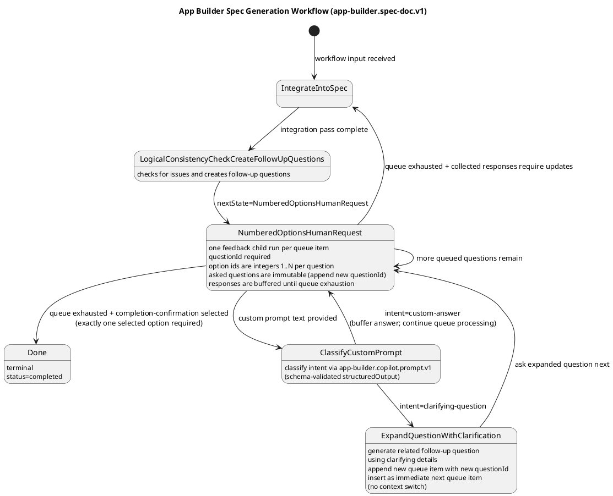

# App Builder Workflow Spec: Spec-Doc Generation FSM (v1)

## 1) Purpose

Define a finite state machine workflow that converts an initial human request into an implementation-ready specification document.

This document describes the first workflow in a planned series of app/feature builder workflows.

## 2) Scope

In scope:
- one workflow: `app-builder.spec-doc.v1`
- iterative clarification loop
- spec integration and logical consistency checks
- completion when the spec is implementation-ready

Out of scope:
- implementation of interactive user-feedback transport in `workflow-app-builder`
- UI for review/approval
- runtime server orchestration details beyond required dependency contracts

## 3) Planned Workflow Series (initial)

Only the first workflow is specified now.

1. `app-builder.spec-doc.v1` (this doc)
2. Future: implementation-plan generation workflow
3. Future: code-generation execution workflow
4. Future: validation/refinement workflow

## 4) Workflow Identity

- `workflowType`: `app-builder.spec-doc.v1`
- `workflowVersion`: `1.0.0`
- package: `workflow-app-builder`
- primary dependency workflow: `app-builder.copilot.prompt.v1`

## 5) Intent and Inputs/Outputs

## 5.1 Input Contract

```ts
export interface SpecDocGenerationInput {
  request: string;
  targetPath?: string;
  constraints?: string[];
  maxClarificationLoops?: number; // default 5
  copilotPromptOptions?: {
    baseArgs?: string[];
    allowedDirs?: string[];
    timeoutMs?: number;
    cwd?: string;
  };
}
```

## 5.2 Output Contract

```ts
export interface SpecDocGenerationOutput {
  status: "completed";
  specPath: string;
  summary: {
    loopsUsed: number;
    unresolvedQuestions: 0;
  };
  artifacts: {
    integrationPasses: number;
    consistencyCheckPasses: number;
  };
}
```

## 6) State Machine Definition

## 6.1 Canonical Flow (sample)



## 6.2 State Semantics

1. `IntegrateIntoSpec`
   - Merge latest human answer(s) into working spec draft.
  - Initial pass integrates `SpecDocGenerationInput` from workflow start (no dedicated feedback start state).
  - Subsequent passes integrate accumulated normalized numbered-options responses after queue exhaustion.
   - Preserve prior accepted decisions unless explicitly overridden.

2. `LogicalConsistencyCheckCreateFollowUpQuestions`
   - Validate internal consistency of scope, constraints, contracts, and acceptance criteria.
   - Generate follow-up questions when inconsistencies or missing decisions are detected.
  - Route to `NumberedOptionsHumanRequest` with numbered follow-up questions for either unresolved issues or completion confirmation.

3. `NumberedOptionsHumanRequest`
   - Request user selection among explicit choices.
  - Used when decision branches are clear and mutually exclusive.
  - If multiple numbered follow-up questions exist, this state self-loops question-by-question until all answers are captured.
  - User may answer by selecting numbered options or by providing a custom prompt; responses are accumulated until the numbered queue is exhausted.
  - If custom prompt text is provided, route through `ClassifyCustomPrompt`; classification results return to numbered-options processing.
  - If no unresolved questions remain, this state asks explicit completion confirmation (`Done` vs additional work for `IntegrateIntoSpec`).

4. `ClassifyCustomPrompt`
  - Uses `app-builder.copilot.prompt.v1` with schema-validated `structuredOutput` to classify custom prompt intent as either clarifying-question or custom-answer.
  - Does not transition directly to `IntegrateIntoSpec`; custom-answer returns to `NumberedOptionsHumanRequest`, while clarifying-question transitions to `ExpandQuestionWithClarification`.

5. `ExpandQuestionWithClarification`
  - Materializes a related follow-up question from clarifying intent.
  - Appends a new immutable queue item with a new `questionId` and inserts it as immediate next question.

6. `Done`
   - Terminal state.
   - Spec is internally consistent and implementation-ready under current constraints.

## 6.3 Transition Rules and Guards

- `[*] -> IntegrateIntoSpec`
  - Guard: workflow input is available and validated.
- `IntegrateIntoSpec -> LogicalConsistencyCheckCreateFollowUpQuestions`
  - Guard: integration pass complete.
- `LogicalConsistencyCheckCreateFollowUpQuestions -> NumberedOptionsHumanRequest`
  - Guard: consistency-check pass produces numbered follow-up questions and/or explicit completion confirmation choices.
- `NumberedOptionsHumanRequest -> NumberedOptionsHumanRequest`
  - Guard: additional numbered follow-up questions remain to be asked and answered, and no custom prompt text is provided with the current response.
- `NumberedOptionsHumanRequest -> IntegrateIntoSpec`
  - Guard: numbered queue is exhausted and collected responses (selected options and/or custom-answer text) require spec updates.
- `NumberedOptionsHumanRequest -> ClassifyCustomPrompt`
  - Guard: custom prompt text is provided with current response (takes precedence over direct queue self-loop evaluation for that response).
- `ClassifyCustomPrompt -> NumberedOptionsHumanRequest`
  - Guard: intent is custom-answer, so answer is buffered and queue processing continues.
- `ClassifyCustomPrompt -> ExpandQuestionWithClarification`
  - Guard: intent is clarifying-question.
- `ExpandQuestionWithClarification -> NumberedOptionsHumanRequest`
  - Guard: follow-up question has been materialized and inserted as immediate next queue item.
- `NumberedOptionsHumanRequest -> Done`
  - Guard: numbered queue is exhausted and completion-confirmation is selected with exactly one selected option.

## 6.4 NumberedOptionsHumanRequest Implementation Detail (MVP)

Execution model:
- This state is implemented as a deterministic question queue processor.
- Input queue is created from `LogicalConsistencyCheckCreateFollowUpQuestions` output and stored in workflow context/state data.
- Each queue item is a numbered-options question with stable `questionId`, `prompt`, and `options[]`.
- Within each question, option IDs are unique contiguous integers starting at `1`.

Question queue construction:
- If consistency checks report unresolved issues, generate one or more numbered questions mapped to those issues.
- If consistency checks return zero follow-up questions, workflow logic must synthesize a completion-confirmation numbered question that includes an explicit "spec is done" option.
- Canonical completion option IDs are not required; done is interpreted from the selected option as authored for that specific question.
- Each generated option should include concise pros/cons to help user decision-making (use option `description` with a clear `Pros:` / `Cons:` format).
- Queue order must be stable across retries/recovery (deterministic ordering by generated `questionId`).
- Clarification-generated follow-up questions must be inserted as the immediate next queue item (ahead of older unresolved items) to avoid context switching.

Per-question execution:
- For the current queue item, request human feedback through the server-owned feedback workflow.
- Launch one feedback child run per queue item (no batching of multiple questions into one feedback run).
- Populate `HumanFeedbackRequestInput.questionId` with the queue item's stable `questionId` when launching each feedback request.
- Expect server feedback projection persistence to store this value as `human_feedback_requests.question_id` for question-level diagnostics and replay correlation.
- Accept response payload with `selectedOptionIds?: number[]` and optional `text?: string` custom prompt.
- Treat invalid `selectedOptionIds` as request-validation errors from the feedback API (no answer recorded; question remains pending until valid response).
- For completion-confirmation questions, require exactly one selected option; treat zero or multi-select responses as request-validation errors.
- Assume no protocol-level max for custom `text` in MVP; handle any implementation-local validation errors as retryable feedback submission failures.
- Persist normalized answer record in state data:
  - `questionId`,
  - `selectedOptionIds` (possibly empty),
  - `text` (possibly empty),
  - `answeredAt` timestamp.

Custom prompt handling:
- Custom prompt text is additive context, not a replacement for numbered options.
- Custom prompt intent classification (clarifying-question vs custom-answer) is delegated to `app-builder.copilot.prompt.v1`.
- Classification must be derived from schema-validated `structuredOutput` (not ad-hoc local heuristics) before choosing the next transition.
- Example: alternative answer text augments selected option intent, is buffered with the current answer set, and is carried into `IntegrateIntoSpec` after queue exhaustion.
- Example: clarifying question text may produce an additional numbered follow-up queue item; that item is inserted next, and transition remains `NumberedOptionsHumanRequest -> NumberedOptionsHumanRequest`.
- Asked numbered-options questions are immutable once issued; clarifications must append a new queue item with a new `questionId`.

Transition resolution after each response:
- If custom prompt text is provided, transition to `ClassifyCustomPrompt` first for intent classification.
- If custom prompt intent is clarifying-question, transition to `ExpandQuestionWithClarification`, insert the generated follow-up as immediate next, then transition to `NumberedOptionsHumanRequest`.
- If custom prompt intent is custom-answer, buffer it and continue numbered queue processing.
- If unasked queue items remain and no custom prompt text is pending classification, transition to `NumberedOptionsHumanRequest` (self-loop).
- If queue is exhausted and completion-confirmation indicates done with exactly one selected option, transition to `Done`.
- Otherwise transition to `IntegrateIntoSpec` with accumulated normalized answers (including buffered custom-answer prompts) as integration input.

Loop accounting:
- Every `NumberedOptionsHumanRequest` self-loop increments clarification-loop usage.
- Exceeding `maxClarificationLoops` fails the run per section 11.

## 6.5 IntegrateIntoSpec Input Contract (MVP)

`IntegrateIntoSpec` consumes a normalized state input that supports both initial draft creation and later feedback-driven updates.

```ts
export interface IntegrateIntoSpecInput {
  source: "workflow-input" | "numbered-options-feedback";
  request: string;
  targetPath?: string;
  constraints?: string[];
  specPath?: string;
  answers?: Array<{
    questionId: string;
    selectedOptionIds: number[];
    text?: string;
    answeredAt: string; // ISO-8601 timestamp
  }>;
}
```

Contract notes:
- `source: "workflow-input"` is used for the first pass and carries workflow input fields.
- `source: "numbered-options-feedback"` is used after numbered queue exhaustion when accumulated responses require spec updates.
- `answers` is optional for initial pass and, when present, is the normalized answer record accumulated in `NumberedOptionsHumanRequest`.
- `specPath` allows integration into an existing working draft path from prior passes.

## 7) Dependency on `app-builder.copilot.prompt.v1`

This workflow is primarily an orchestration layer that composes repeated calls to `app-builder.copilot.prompt.v1` for:
- drafting and revising spec sections,
- generating follow-up questions,
- running consistency-check prompts,
- producing final implementation-ready markdown.

`app-builder.spec-doc.v1` must not re-implement Copilot ACP protocol details; it delegates prompt execution to `app-builder.copilot.prompt.v1`.

For deterministic orchestration, every `app-builder.copilot.prompt.v1` call in this workflow must provide `outputSchema` and parse `structuredOutput` instead of branching from unstructured text.

## 7.1 Required Schemas

Schema artifacts for this workflow:
- `packages/workflow-app-builder/docs/schemas/spec-doc/numbered-question-item.schema.json`
- `packages/workflow-app-builder/docs/schemas/spec-doc/spec-integration-input.schema.json`
- `packages/workflow-app-builder/docs/schemas/spec-doc/spec-integration-output.schema.json`
- `packages/workflow-app-builder/docs/schemas/spec-doc/consistency-check-output.schema.json`
- `packages/workflow-app-builder/docs/schemas/spec-doc/custom-prompt-classification-output.schema.json`
- `packages/workflow-app-builder/docs/schemas/spec-doc/clarification-follow-up-output.schema.json`
- `packages/workflow-app-builder/docs/schemas/spec-doc/spec-doc-generation-output.schema.json`

Schema ownership boundary:
- `packages/workflow-app-builder/docs/schemas/spec-doc/numbered-question-item.schema.json` extends the server-owned base envelope in `docs/schemas/human-input/numbered-question-item.schema.json` by adding app-builder-specific `kind` semantics.
- Numbered response transport validation remains server-owned via `docs/schemas/human-input/numbered-options-response-input.schema.json`.

Minimum usage contract by FSM state:
- `IntegrateIntoSpec`
  - `inputSchema` must use `spec-integration-input.schema.json`.
  - `outputSchema` must use `spec-integration-output.schema.json`.
  - `structuredOutput.specPath` is the markdown file path for the updated working draft.
- `LogicalConsistencyCheckCreateFollowUpQuestions`
  - `outputSchema` must use `consistency-check-output.schema.json`.
  - `structuredOutput.followUpQuestions` provides deterministic ordered issue-resolution question queue payload and may be empty.
  - each queue item must conform to `numbered-question-item.schema.json` with `kind: "issue-resolution"`.
  - if `structuredOutput.followUpQuestions` is empty, workflow logic synthesizes one completion-confirmation queue item with an explicit "spec is done" option before entering `NumberedOptionsHumanRequest`.
- `ClassifyCustomPrompt`
  - `outputSchema` must use `custom-prompt-classification-output.schema.json`.
  - `structuredOutput.intent` is the single source of truth for intent routing (`clarifying-question` vs `custom-answer`).
- `ExpandQuestionWithClarification`
  - `outputSchema` must use `clarification-follow-up-output.schema.json`.
  - `structuredOutput.followUpQuestion` must conform to server-owned base `docs/schemas/human-input/numbered-question-item.schema.json`; workflow logic assigns `kind: "issue-resolution"` and inserts as immediate next queue item.
- `Done`
  - terminal payload must conform to `spec-doc-generation-output.schema.json`.

File output rule:
- The generated spec artifact is a markdown file on disk (`*.md`).
- Schemas must validate routing/metadata contracts and file references, not embed full spec body text.

Transition mapping from consistency-check output:
- if `followUpQuestions` is empty, synthesize one completion-confirmation numbered question in workflow logic (with explicit "spec is done" option) and enqueue it.
- transition to `NumberedOptionsHumanRequest` (fixed workflow logic, not model-selected state).

Transition mapping from numbered-options response:
- if custom prompt text is provided: transition to `ClassifyCustomPrompt` (evaluate this first for the current response).
- if custom prompt intent is classified as clarifying-question: transition to `ExpandQuestionWithClarification`, insert related follow-up as immediate next, then transition to `NumberedOptionsHumanRequest`.
- if user selects completion confirmation option and the numbered queue is exhausted with exactly one selected option: transition to `Done`.
- if custom prompt intent is classified as custom-answer: buffer response and transition to `NumberedOptionsHumanRequest`.
- if user selects non-completion numbered option(s) while questions remain: record response and transition to `NumberedOptionsHumanRequest`.
- if additional numbered follow-up questions remain and no custom prompt text is provided: transition to `NumberedOptionsHumanRequest`.
- if queue is exhausted and collected responses require updates (including custom-answer text): transition to `IntegrateIntoSpec`.

Numbered-options question requirements:
- For workflow-synthesized completion-confirmation questions, options must include at least one explicit "spec is done" numbered option.
- Completion-confirmation questions do not require canonical/standardized option IDs.
- Numbered option IDs must be unique contiguous integers starting at `1` for each question.
- Numbered-options prompts must allow optional custom prompt text in addition to numbered selections.
- Each option should include decision support details by populating `description` with concise `Pros:` and `Cons:` bullets.

Validation behavior:
- If `structuredOutput` is not valid JSON, fail the run.
- If JSON is valid but does not satisfy the required schema for the current state, fail the run with schema-validation error details.

## 7.2 Hardcoded Copilot Prompt Templates (MVP)

This workflow should use fixed prompt templates (versioned in code) for each state that delegates to `app-builder.copilot.prompt.v1`.

Prompt-template rules:
- Prompt bodies are hardcoded string literals; runtime provides only variable interpolation data.
- Every template below must be paired with the state-specific `outputSchema` from section 7.1.
- `app-builder.copilot.prompt.v1` is responsible for issuing the schema follow-up prompt when `outputSchema` is provided; templates below are task prompts, not schema-instruction prompts.
- The workflow must branch only from schema-validated `structuredOutput`.
- All IDs and list ordering must be deterministic for identical inputs.
- Prompt text should describe model task intent only; transition/routing authority remains in workflow logic + schema validation.

### 7.2.1 `IntegrateIntoSpec` prompt (`spec-doc.integrate.v1`)

Usage:
- state: `IntegrateIntoSpec`
- output schema: `spec-integration-output.schema.json`

Required runtime interpolation variables:
- `{{request}}`
- `{{source}}` (`workflow-input` or `numbered-options-feedback`)
- `{{targetPath}}` (optional)
- `{{constraintsJson}}` (JSON array)
- `{{specPath}}` (optional existing draft path)
- `{{answersJson}}` (JSON array of normalized answers; optional/empty on first pass)

Prompt text:

```text
You are generating and maintaining an implementation-ready software specification markdown document.

You must:
1) Preserve prior accepted decisions unless explicitly overridden by newer answers.
2) Integrate all provided constraints and normalized numbered-options answers.
3) Keep the spec concrete and testable.
4) Ensure sections exist for: objective/scope, non-goals, constraints/assumptions, interfaces/contracts, acceptance criteria.
5) Write or update the markdown file in the workspace.

Input context:
- source: {{source}}
- request: {{request}}
- targetPath: {{targetPath}}
- existingSpecPath: {{specPath}}
- constraints: {{constraintsJson}}
- answers: {{answersJson}}

Spec quality requirements:
- No unresolved contradictions in scope, constraints, or interface contracts.
- Acceptance criteria must be testable and unambiguous.
- Keep language implementation-ready and avoid vague statements.
```

### 7.2.2 `LogicalConsistencyCheckCreateFollowUpQuestions` prompt (`spec-doc.consistency-check.v1`)

Usage:
- state: `LogicalConsistencyCheckCreateFollowUpQuestions`
- output schema: `consistency-check-output.schema.json`

Required runtime interpolation variables:
- `{{request}}`
- `{{specPath}}`
- `{{constraintsJson}}`
- `{{loopCount}}`
- `{{remainingQuestionIdsJson}}` (from latest integration metadata)

Prompt text:

```text
You are validating a spec document for implementation readiness and generating deterministic numbered follow-up questions.

Input context:
- request: {{request}}
- specPath: {{specPath}}
- constraints: {{constraintsJson}}
- currentLoopCount: {{loopCount}}
- remainingQuestionIdsFromIntegration: {{remainingQuestionIdsJson}}

Evaluation checklist (must map to readinessChecklist booleans):
1) Scope/objective present.
2) Non-goals present.
3) Constraints/assumptions explicit.
4) Interfaces/contracts defined where needed.
5) Acceptance criteria testable.

Question-generation rules:
- If blocking issues exist: generate issue-resolution questions for each blocking decision gap.
- If no blocking issues remain: return an empty `followUpQuestions` array (completion-confirmation question is synthesized by workflow logic).
- Each question must include:
  - stable deterministic questionId,
  - prompt,
  - options with unique contiguous integer ids starting at 1,
  - per-option `description` that includes concise `Pros:` and `Cons:`,
  - kind set to `issue-resolution`.
- Keep followUpQuestions ordering deterministic.

```

### 7.2.3 `ClassifyCustomPrompt` prompt (`spec-doc.classify-custom-prompt.v1`)

Usage:
- state: `ClassifyCustomPrompt`
- output schema: `custom-prompt-classification-output.schema.json`

Required runtime interpolation variables:
- `{{questionId}}`
- `{{questionPrompt}}`
- `{{selectedOptionIdsJson}}`
- `{{customText}}`

Prompt text:

```text
Classify the user's custom text for a numbered-options response.

Input context:
- questionId: {{questionId}}
- questionPrompt: {{questionPrompt}}
- selectedOptionIds: {{selectedOptionIdsJson}}
- customText: {{customText}}

Classification policy:
- intent = clarifying-question when the custom text is primarily asking for clarification, disambiguation, or additional information before deciding.
- intent = custom-answer when the custom text primarily provides an answer, preference, constraint, or detail to be integrated.
- Choose exactly one intent.

```

### 7.2.4 `ExpandQuestionWithClarification` prompt (`spec-doc.expand-clarification.v1`)

Usage:
- state: `ExpandQuestionWithClarification`
- output schema: `clarification-follow-up-output.schema.json`

Required runtime interpolation variables:
- `{{sourceQuestionId}}`
- `{{sourceQuestionPrompt}}`
- `{{sourceOptionsJson}}`
- `{{clarifyingQuestionText}}`
- `{{nextQuestionOrdinal}}`

Prompt text:

```text
Create one deterministic numbered follow-up question from the provided clarifying question.

Input context:
- sourceQuestionId: {{sourceQuestionId}}
- sourceQuestionPrompt: {{sourceQuestionPrompt}}
- sourceOptions: {{sourceOptionsJson}}
- clarifyingQuestionText: {{clarifyingQuestionText}}
- nextQuestionOrdinalHint: {{nextQuestionOrdinal}}

Rules:
- followUpQuestion.questionId must be new and deterministic.
- followUpQuestion.options must use contiguous integer ids starting at 1.
- followUpQuestion options should include `description` with concise `Pros:` and `Cons:` for each choice.
- The question should resolve the clarification with minimal ambiguity and clear decision branches.

```

Implementation note:
- Keep these templates in code as versioned constants and include the template ID (e.g., `spec-doc.integrate.v1`) in observability events for prompt traceability.

## 8) Human Feedback Collection Boundary (Decoupling Requirement)

Human feedback transport/orchestration is currently unsolved for server execution and must be modeled as a server-level default workflow capability.

Required boundary:
- `workflow-app-builder` depends on an abstract “request human feedback / await response” contract.
- concrete implementation lives in server/runtime orchestration and server spec.
- changes to feedback transport, waiting semantics, or timeout/escalation policy must not require edits in `workflow-app-builder` workflows.

Server-spec placement requirement:
- introduce/maintain feedback orchestration behavior in `docs/typescript-server-workflow-spec.md` (not in app-builder package internals).

## 9) Minimum Observability Requirements

Per run, emit events for:
- entering each FSM state,
- question generated (numbered-options follow-up/confirmation),
- user response received,
- spec integration pass completed,
- consistency-check outcome,
- terminal completion.

All events should include `runId`, `workflowType`, `state`, and sequence ordering consistent with shared runtime contracts.

## 10) Completion Criteria (for workflow execution)

`Done` is valid only when all are true:
- scope/objective section is present,
- non-goals are present,
- constraints/assumptions are explicit,
- interfaces/contracts are defined where needed,
- acceptance criteria are testable,
- no unresolved blocking questions remain,
- user explicitly confirms completion from `NumberedOptionsHumanRequest`.

## 10.1 Invariants (Implementation/Test)

- `Done` is reachable only from `NumberedOptionsHumanRequest`.
- `LogicalConsistencyCheckCreateFollowUpQuestions` never transitions directly to `Done`.
- `LogicalConsistencyCheckCreateFollowUpQuestions` transitions only to `NumberedOptionsHumanRequest`.
- `LogicalConsistencyCheckCreateFollowUpQuestions` always transitions to `NumberedOptionsHumanRequest` via fixed workflow logic.
- If consistency output has empty `followUpQuestions`, workflow logic synthesizes exactly one completion-confirmation question before entering `NumberedOptionsHumanRequest`.
- Completion confirmation is explicit user intent selected in `NumberedOptionsHumanRequest`.
- Terminal completed output must satisfy:
  - `status === "completed"`
  - `specPath` ends with `.md`
  - `summary.unresolvedQuestions === 0`

## 11) Failure and Exit Conditions

- If clarification loop exceeds `maxClarificationLoops`, fail with explicit unresolved-question summary.
- If delegated Copilot prompt workflow fails, propagate failure with stage context.
- If human feedback times out/cancels (per server policy), transition to failed/cancelled according to server lifecycle rules.

## 12) Implementation Notes

- Keep this workflow declarative with explicit states/transitions metadata.
- Preserve generator-friendly metadata for future code generation alignment.
- Do not couple to transport details for human interaction.
- Use schema-validated `structuredOutput` for all state branching and completion payload construction.
